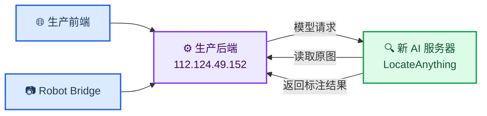

# LocateAnything AI 服务迁移部署指南

_目标：将 3.83B BF16 LocateAnything 服务从 `xmu44` 迁移到新的 Linux GPU 服务器，并继续连接 `112.124.49.152` 上的生产后端_

---

## 📋 迁移结论

新服务器只需要运行 AI 模型服务，不需要部署前端、Spring Boot、MySQL 或 Robot Bridge。生产数据和机器人图片仍保留在 `112.124.49.152`。

| 项目 | 结论 |
| --- | --- |
| **GPU 数量** | 1 张 |
| **最低显存** | 32 GB，仅建议单请求 |
| **推荐显存** | 40–48 GB 以上 |
| **CPU** | 最低 4 核，推荐 8 核 |
| **内存** | 最低 16 GB，推荐 32 GB |
| **可用磁盘** | 最低 30 GB，推荐 50 GB 以上本地 SSD |
| **推理并发** | 1 |
| **Uvicorn worker** | 1 |

当前模型约 3.83B 参数，BF16 权重约 7.14 GiB；已有实测运行显存约 26 GiB。A100 40GB、L40S 48GB 或同等级且支持 BF16 的 NVIDIA GPU 均可，不要求继续使用 A800 80GB。

## 🌐 迁移后架构



迁移必须同时打通两个方向：

1. 生产后端调用新 AI 服务
2. 新 AI 服务读取生产后端 `/model-files/` 中的原图

## 📦 迁移内容

只迁移以下目录，并保持相对目录关系：

```text
Intelligent-Power-Inspection/
├── ai-services/
│   ├── common/
│   └── locate-anything-service/
└── model_weights/
```

不需要迁移：

- `backend/` 运行实例和数据库
- `frontend/` 构建产物
- Robot Bridge 数据
- `annotated-images/` 历史临时标注图，除非需要保留审计记录
- Hugging Face 下载缓存，模型权重完整时可重新生成

建议从已确认的 Git 提交导出服务代码，避免直接复制 `xmu44` 工作区中的未提交修改。复制前记录版本：

```bash
git -C /path/to/Intelligent-Power-Inspection rev-parse HEAD
git -C /path/to/Intelligent-Power-Inspection status --short
```

代码可通过 Git 部署；约 7.14 GiB 的 `model_weights/` 应使用 `rsync` 或同类可续传工具单独传输。传输后比对目录大小，并对 Safetensors 文件计算 SHA-256：

```bash
du -sh /path/to/Intelligent-Power-Inspection/model_weights
find /path/to/Intelligent-Power-Inspection/model_weights \
  -type f -name '*.safetensors' -print0 \
  | sort -z \
  | xargs -0 sha256sum
```

源服务器和新服务器的哈希结果必须一致。

## 🔧 安装新服务器

### 验证 GPU

```bash
nvidia-smi
```

新服务器必须能识别 NVIDIA GPU，且 GPU 具有至少 32 GB 显存。

### 创建 Python 环境

当前已验证的组合为 Python 3.11、PyTorch 2.5.1+cu121 和 Transformers 4.57.1。

```bash
cd /path/to/Intelligent-Power-Inspection
conda env create \
  -f ai-services/locate-anything-service/environment.yml

conda run -n ipi-locate-anything \
  python -m pip install \
  -r ai-services/locate-anything-service/requirements-torch-cu121.txt
```

验证环境：

```bash
conda run -n ipi-locate-anything python -c \
  "import torch, transformers; print(torch.__version__); print(transformers.__version__); print(torch.cuda.is_available()); print(torch.cuda.is_bf16_supported()); print(torch.cuda.get_device_name(0))"
```

`torch.cuda.is_available()` 和 `torch.cuda.is_bf16_supported()` 都应返回 `True`。

## 🔐 配置 AI 服务

在新 AI 服务器创建受保护的环境文件，例如 `/etc/power-inspection/locate-anything.env`：

```dotenv
CUDA_VISIBLE_DEVICES=0
LOCATE_ANYTHING_MODEL_PATH=/opt/power-inspection-ai/current/model_weights
LOCATE_ANYTHING_MODEL_VERSION=model_weights
LOCATE_ANYTHING_DEVICE=cuda
LOCATE_ANYTHING_DTYPE=bfloat16
LOCATE_ANYTHING_MAX_NEW_TOKENS=128
ANNOTATED_OUTPUT_DIR=/var/lib/power-inspection-ai/annotated-images
ANNOTATED_BASE_URL=http://127.0.0.1:9001/files/annotated
```

建议目录：

```text
/opt/power-inspection-ai/current/
├── ai-services/
└── model_weights/

/var/lib/power-inspection-ai/
└── annotated-images/
```

真实路径可以不同，但 systemd 的工作目录、`LOCATE_ANYTHING_MODEL_PATH` 和 `ANNOTATED_OUTPUT_DIR` 必须一致。

## 🚀 配置常驻模型服务

创建 `/etc/systemd/system/locate-anything.service`：

```ini
[Unit]
Description=LocateAnything AI Model Service
After=network-online.target
Wants=network-online.target

[Service]
Type=simple
User=<ai-service-user>
Group=<ai-service-group>
WorkingDirectory=/opt/power-inspection-ai/current/ai-services/locate-anything-service
EnvironmentFile=/etc/power-inspection/locate-anything.env
ExecStart=/path/to/conda/envs/ipi-locate-anything/bin/python -m uvicorn app:app --host 127.0.0.1 --port 9001 --workers 1
Restart=on-failure
RestartSec=5
TimeoutStartSec=180
NoNewPrivileges=true

[Install]
WantedBy=multi-user.target
```

将 `<ai-service-user>`、`<ai-service-group>` 和 Python 路径替换为实际值，然后启动：

```bash
sudo systemctl daemon-reload
sudo systemctl enable --now locate-anything
sudo systemctl status locate-anything --no-pager
```

模型冷启动约需 60 秒。验证：

```bash
curl --noproxy '*' http://127.0.0.1:9001/health
curl --noproxy '*' http://127.0.0.1:9001/ready
nvidia-smi
```

预期：

```json
{"status":"ok"}
```

```json
{"ready":true,"modelVersion":"model_weights"}
```

## 🔗 连接生产后端

优先选择私网直连；只有两台服务器无法互相直连时，才使用 SSH 隧道。

### 方案 A：私网直连

适用条件：生产服务器与新 AI 服务器有互通的私网或 VPN。

1. AI 服务绑定新 AI 服务器的私网 IP，不绑定公网 IP
2. 防火墙只允许生产服务器访问 AI 的 `9001`
3. AI 服务器通过生产后端的私网地址读取 `/model-files/`

生产服务器 `/etc/power-inspection/application.yml`：

```yaml
app:
  model:
    mode: http
    locate-anything:
      base-url: http://<new-ai-private-ip>:9001
      input-file-base-url: http://<production-private-ip>:8080/model-files/
      timeout-seconds: 900
      generation-mode: fast
```

### 方案 B：新 AI 服务器主动建立 SSH 隧道

适用条件：新 AI 服务器可以 SSH 到 `112.124.49.152`，但生产服务器不能主动访问 AI 服务器。该模式与当前 `xmu44` 方案一致。

新 AI 服务器必须使用 SSH 密钥登录生产服务器。先验证：

```bash
ssh -o BatchMode=yes -o ConnectTimeout=10 \
  ljw@112.124.49.152 true
```

新建隧道时先使用预备端口，避免与当前 `xmu44` 的 `19001/18082` 冲突：

```text
生产服务器 127.0.0.1:19002 → 新 AI 服务器 127.0.0.1:9001
新 AI 服务器 127.0.0.1:18083 → 生产服务器 127.0.0.1:8080
```

在新 AI 服务器创建 `/etc/systemd/system/locate-anything-tunnel.service`：

```ini
[Unit]
Description=LocateAnything SSH Tunnel to Production Backend
After=network-online.target locate-anything.service
Wants=network-online.target
Requires=locate-anything.service

[Service]
Type=simple
User=<ssh-user>
ExecStart=/usr/bin/ssh -NT -o BatchMode=yes -o ExitOnForwardFailure=yes -o TCPKeepAlive=yes -o ServerAliveInterval=15 -o ServerAliveCountMax=6 -R 127.0.0.1:19002:127.0.0.1:9001 -L 127.0.0.1:18083:127.0.0.1:8080 ljw@112.124.49.152
Restart=always
RestartSec=5

[Install]
WantedBy=multi-user.target
```

将 `<ssh-user>` 替换为持有 SSH 私钥和 `known_hosts` 记录的本地用户，然后启动：

```bash
sudo systemctl daemon-reload
sudo systemctl enable --now locate-anything-tunnel
sudo systemctl status locate-anything-tunnel --no-pager
```

验证预备隧道：

在生产服务器执行：

```bash
curl --noproxy '*' http://127.0.0.1:19002/ready
```

在新 AI 服务器执行：

```bash
curl --noproxy '*' http://127.0.0.1:18083/api/v1/health
```

两项都成功后，才能进入切换步骤。

## 🔄 正式切换

以下步骤以 SSH 隧道方案为例。切换前保持 `xmu44` 模型和旧隧道运行。

1. 在生产服务器备份配置：

```bash
sudo cp -a /etc/power-inspection/application.yml \
  /etc/power-inspection/application.yml.before-ai-migration
```

2. 将生产后端模型配置切换到预备端口：

```yaml
app:
  model:
    mode: http
    locate-anything:
      base-url: http://127.0.0.1:19002
      input-file-base-url: http://127.0.0.1:18083/model-files/
      timeout-seconds: 900
      generation-mode: fast
```

3. 重启并检查生产后端：

```bash
sudo systemctl restart power-inspection-backend
sudo systemctl status power-inspection-backend --no-pager
curl --noproxy '*' http://127.0.0.1:8080/api/v1/health
curl --noproxy '*' http://127.0.0.1:19002/ready
```

4. 先用“检测策略 → 本地上传”执行一张测试图片，只启用一个检测项
5. 再选择一张真实“机器人图片”执行检测
6. 两次检测都成功后，观察日志和资源至少 15 分钟
7. 确认稳定后，再停止 `xmu44` 的旧隧道和旧模型服务

> ⚠️ **不要先停止 xmu44。** 新模型、预备隧道和端到端检测必须先全部通过，旧服务只在验收完成后下线。

## ✅ 验收标准

| 检查 | 位置 | 成功标准 |
| --- | --- | --- |
| **模型健康** | 新 AI 服务器 | `/ready` 返回 `ready=true` |
| **后端到模型** | 生产服务器 | `19002/ready` 返回成功 |
| **模型到图片** | 新 AI 服务器 | `18083/api/v1/health` 返回成功 |
| **本地上传检测** | 生产前端 | 状态最终为 `SUCCEEDED` |
| **机器人图片检测** | 生产前端 | 原图可读取并显示标注结果 |
| **模型日志** | 新 AI 服务器 | 图片 `GET` 和模型 `POST` 均为 200 |
| **错误日志** | 两台服务器 | 无 OOM、Traceback 或持续重启 |

新 AI 服务日志：

```bash
sudo journalctl -u locate-anything -f
```

生产后端日志：

```bash
sudo journalctl -u power-inspection-backend -f
```

## ⚠️ 回滚

如果切换后检测失败：

1. 保持新服务器现场不变，先保存两端日志
2. 在生产服务器恢复旧配置：

```bash
sudo cp -a /etc/power-inspection/application.yml.before-ai-migration \
  /etc/power-inspection/application.yml
sudo systemctl restart power-inspection-backend
```

3. 验证旧链路：

```bash
curl --noproxy '*' http://127.0.0.1:19001/ready
curl --noproxy '*' http://127.0.0.1:8080/api/v1/health
```

4. 重新执行一次检测，确认业务恢复
5. 查明新服务器失败原因后再安排下一次切换

## 📍 下线 xmu44

只有以下条件全部满足后，才停止 `xmu44` 服务：

- 新 AI 服务连续运行稳定
- SSH 隧道或私网链路已做成常驻服务
- 本地上传和机器人图片检测都成功
- 生产后端日志没有模型调用错误
- 新服务器有显存、磁盘和服务重启告警
- 回滚配置和旧模型保留至少一个观察周期

下线后不要立即删除 `xmu44` 的模型权重和环境。先停止服务并保留文件，确认新服务器稳定后再安排清理。

## 🔐 生产要求

- AI 服务保持 `--workers 1`
- 同一时间只允许一个 GPU 推理任务，使用队列或互斥锁串行处理
- `9001` 不直接暴露到公网
- SSH 隧道使用独立密钥、`BatchMode=yes` 和受限账号
- 定期清理 `annotated-images/`
- 监控 GPU 显存、请求耗时、失败率、磁盘空间和 systemd 重启次数
- 配置文件和 systemd unit 中不得写入密码或私钥内容

