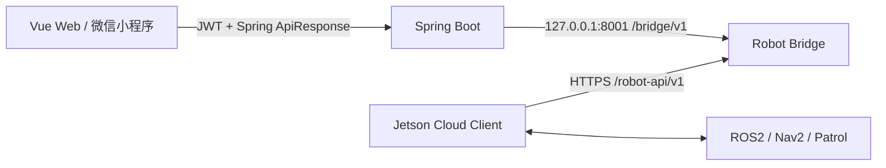

# Robot Bridge 集成索引

## 一页架构

公网连接只由 Jetson 发起。浏览器不接触 Bridge Token，Bridge 不访问 Jetson，Jetson 不需要公网 IP。Spring 保持业务 API 和 STOMP；Bridge 负责持久命令、设备鉴权、事件顺序和 deployment 缓存。

## 责任矩阵

| 模块 | 责任 | 不负责 |
| --- | --- | --- |
| 前端 | 页面、权限展示、任务操作、STOMP、错误提示 | Bridge 鉴权、sequence、设备 token |
| Spring Boot | 用户权限、业务任务、Bridge 管理调用、状态同步、事务、STOMP | Robot lease、ROS 执行 |
| Robot Bridge | 命令队列、设备鉴权、事件持久化、sequence 连续应用、deployment 缓存 | 浏览器业务 API、反向连接 Jetson |
| Jetson | 路线/地图校验、Nav2 执行、安全控制、事件生成、断网补传 | 平台用户权限、浏览器响应包装 |

## 文档索引

- [机器人巡检图片上传与检测策略联调](robot-inspection-image-upload-guide.md)：机器人图片上传、Bridge 转发、平台校验和检测策略人工检测闭环。
- [Robot Platform Protocol v1](../protocol/robot-platform-v1.md)：唯一协议事实来源。
- [机器人心跳接入与联调（P2a）](robot-heartbeat-operations.md)：身份模型、在线状态、平台只读 API 与无运动联调。
- [后端对接](backend-robot-bridge.md)：Spring Client、状态同步、失败处理和改造清单。
- [前端对接](frontend-robot-bridge.md)：REST/STOMP、状态、按钮与 TypeScript 示例。
- [状态与事件合同](state-event-contract.md)：跨团队状态机、事件和完整时间线。
- [验收 Runbook](acceptance-runbook.md)：服务器、无运动、现场运动和恢复阶段。
- [Robot Bridge 部署](../../integration/robot-bridge/deploy/README.md)：服务器安装、升级、回滚、安全和排障。
- [管理接口仅本机访问](../../integration/robot-bridge/deploy/bridge-local-only.md)：Nginx 与 SSH tunnel 边界。

## 当前完成度

| 项目 | 状态 |
| --- | --- |
| FastAPI Bridge 设备 API、管理 API、SQLite 状态机 | 已实现 |
| Jetson HTTPS heartbeat、ACK、事件补传、deployment 下载 | 已实现 |
| Jetson UI Cloud Link 开关与 systemd 单实例 | 已实现 |
| 协议、前后端、部署和验收文档 | 已完成 |
| Spring `app.robot.mode=bridge`、execution 与控制 worker | 已实现，待服务器部署 |
| Spring 轮询 Bridge events 并更新 Task/STOMP | 已实现，待无运动联调 |
| Vue Web revision-backed 任务与 execution 控制 | 已实现，待浏览器验收 |
| 默认地图上传、V13 内容身份、人工审核 PGM 预览 | 已实现并于 2026-07-17 部署；待现场从 APP 发起真实地图验收 |
| 公网无运动部署 | 按 acceptance runbook 执行并记录 |
| 真实路线运动 | 必须等待现场授权 |

## 当前不能做的事情

- 不能把 `READY_FOR_ROBOT` 当成已创建执行或机器人已开始运动。
- 不能让浏览器直接调用 `/bridge/v1` 或持有 `BRIDGE_API_TOKEN`。
- 不能把旧 `HttpRobotGateway/MobileBridgeClient` 当成 Heartbeat Bridge Client。
- 不能根据 HTTP 202、ACK 或 ROS publish 判定任务已经 RUNNING。
- 未获现场明确授权前，不能创建 START 或执行任何可能让机器人运动的联调。

## 从哪里开始

### 前端同学

1. 阅读 [前端对接](frontend-robot-bridge.md)。
2. 创建任务时提交已部署的 `routeRevisionId`。
3. 只按 execution 状态展示控制按钮和 pending 语义。
4. 通过 REST/STOMP 恢复 task/robot/event，不直接访问 Bridge。

### 后端同学

1. 阅读 [后端对接](backend-robot-bridge.md) 与协议。
2. 部署 `app.robot.mode=bridge` 与受保护的 Bridge 凭据。
3. 验证 deployment sync、START/control worker 和事件轮询持续运行。
4. 使用 `taskId/executionId/commandId/robotId` 串联日志，确保 202 不直接 RUNNING。

### 运维同学

1. 阅读 [部署文档](../../integration/robot-bridge/deploy/README.md)。
2. 只在回环地址启动 8001，Nginx 只公开 `/robot-api/`。
3. 配置 HTTPS、systemd、备份和版本化 release。
4. 使用 [Runbook](acceptance-runbook.md) 记录 A-C 阶段结果。

### 实机人员

1. 阅读机器人仓库 `docs/cloud_platform_connection.md`。
2. 先完成 heartbeat 与 deployment 无运动检查。
3. 检查现场人员、急停、地图、路线和 Nav2 安全条件。
4. 明确授权后，由现场人员执行 Runbook D-H；Agent 不代替现场触发运动。
