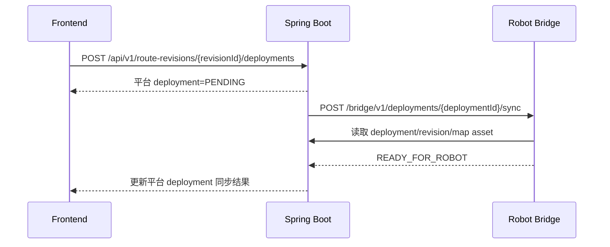

# Spring Boot 对接 Robot Bridge

> 对象：平台 Spring Boot 后端同学。协议字段、状态、错误码以 [Robot Platform Protocol v1](../protocol/robot-platform-v1.md) 为唯一事实来源。

## 1. 目标与边界

推荐保持现有前端 API 不变，由 Spring Boot 在服务端调用 Robot Bridge：

- `POST /api/v1/tasks/{id}/dispatch`
- `POST /api/v1/tasks/{id}/pause`
- `POST /api/v1/tasks/{id}/resume`
- `POST /api/v1/tasks/{id}/takeover`
- `POST /api/v1/tasks/{id}/cancel`
- `GET /api/v1/tasks/{id}/events`

浏览器不得持有 `BRIDGE_API_TOKEN`，不得直接请求 `/bridge/v1`。Spring 继续做用户 JWT、权限、业务任务、事务、STOMP 和统一 `ApiResponse`；Bridge 只做设备鉴权、命令队列、execution/event 状态与 deployment 缓存。

## 2. 当前代码事实

| 代码 | 当前事实 | 对接结论 |
| --- | --- | --- |
| `TaskController` | 已有 dispatch/pause/resume/takeover/cancel/events 路径 | 保持前端路径 |
| `TaskService` | Bridge 模式强制 `routeRevisionId`，创建 Task 时绑定不可变 execution | 旧 `/dispatch` 只服务 simulation/legacy 任务 |
| `TaskExecutionEntity` | 已有 execution、revision、robot、哈希、status、sequence、错误字段 | 禁止再建重复 execution 表 |
| `TaskExecutionService` | 创建并绑定不可变 execution | 继续复用 |
| `RouteDeploymentController/Service` | 平台 deployment 初始为 `PENDING` | 需额外同步 Bridge `READY_FOR_ROBOT` |
| `HttpRobotGateway` | `app.robot.mode=http`，调用 Jetson `/api/debug` | 旧局域网直连，不复用 |
| `MobileBridgeClient` | 调用 `/api/status`、`/api/debug/patrol/*`、`/api/stop` | 不是 Heartbeat Bridge 管理 Client |

## 3. 配置

新增独立模式，不改旧 `simulation/http` 语义：

```properties
app.robot.mode=bridge
ROBOT_BRIDGE_BASE_URL=http://127.0.0.1:8001
ROBOT_BRIDGE_ADMIN_TOKEN=<server-only>
ROBOT_BRIDGE_POLL_INTERVAL_MS=1000
ROBOT_BRIDGE_CONNECT_TIMEOUT_MS=3000
ROBOT_BRIDGE_READ_TIMEOUT_MS=10000
```

要求：

- Base URL 固定为服务器回环地址；不经公网 Nginx。
- Admin Token 只由 Spring 进程读取，日志和 actuator 不输出。
- connect/read timeout 分开配置；控制请求超时后用原 requestId 查询/重试，不能假设失败。
- 平台 JWT 只用于浏览器到 Spring，不能转发给 Bridge。

## 4. 推荐类结构

只新增一条紧凑链路，避免空壳分层：

| 类 | 责任 |
| --- | --- |
| `RobotBridgeProperties` | 绑定 base URL、admin token、轮询与 timeout；启动时校验 |
| `RobotBridgeClient` | 管理 API HTTP 调用、Bearer 注入、原始 JSON 解析、HTTP/错误码映射 |
| `RobotBridgeDispatchService` | 组织 deployment sync、START 和控制命令；持久化 requestId；不提前推进 RUNNING |
| `RobotBridgePoller` | 每秒轮询 active execution 与事件，按事务提交 sequence |
| `RobotBridgeEventMapper` | 将 Bridge execution/event 映射为现有 task/event 字段 |

`RobotBridgeDispatchService` 可直接被 `TaskService` bridge 分支调用；无需再增加 factory、第二套 execution repository 或通用消息总线。

## 5. 路线部署流程



现有平台接口：

```text
POST /api/v1/route-revisions/{revisionId}/deployments
GET  /api/v1/route-deployments/{deploymentId}
```

内部随后调用：

```text
POST /bridge/v1/deployments/{deploymentId}/sync
```

平台 `RouteDeploymentEntity.state` 与 Bridge `READY_FOR_ROBOT` 当前不在同一数据库。建议最小改造：sync 成功后把 Bridge 响应摘要写入现有 `remoteSummaryJson`，平台状态更新为团队既有“成功”值；失败写现有 errorCode/errorMessage。不要复制 manifest 到新的业务表。

只有 Bridge 明确返回 `READY_FOR_ROBOT`，任务才允许 dispatch。`PENDING`、平台成功但 Bridge 未同步、或 Bridge 缓存冲突都不可下发。

## 6. Dispatch 流程

事务前后顺序：

1. 读取 task 与现有 `TaskExecutionEntity`。
2. 取得 `executionId`、`routeRevisionId`、`robotId` 与哈希。
3. 找到对应 deployment，并确认 Bridge 已 `READY_FOR_ROBOT`。
4. 生成一次 `requestId`，先持久化；重试必须复用。
5. 调用 `POST /bridge/v1/executions/{executionId}/start`。
6. 收到 HTTP `202` 后，只将 execution 设为 `DISPATCHING`；若现有 Task 枚举没有该值，Task 暂映射为 `DISPATCHED`。
7. 不得立即设置 `RUNNING`、startedAt 完成态或 robot BUSY 的最终事实。
8. 等 `route_started` 事件和 Bridge execution `RUNNING` 后再更新任务并发布 STOMP。

START 请求字段以协议文档为准，Spring 至少提供 robotId、deploymentId、executorRouteId、requestId、taskId。

## 7. 控制流程

`pause/resume/takeover/cancel` 每次用户操作都生成独立 requestId，并先持久化。调用对应 Bridge API 后：

- HTTP `202`：只显示“命令已入队/处理中”，不修改为目标终态。
- `route_paused`：改 PAUSED。
- `route_resumed`：改 RUNNING。
- `manual_takeover`：改 MANUAL_TAKEOVER。
- `route_canceled`：改 CANCELLED。
- `command_rejected/command_failed`：保留当前 execution 状态，记录错误并发 STOMP。

网络超时使用同 requestId 查询或重试；使用新 requestId 会制造第二条控制意图。

## 8. 轮询与事件消费

默认每 1 秒查询 active execution：

```text
GET /bridge/v1/executions/{executionId}
GET /bridge/v1/executions/{executionId}/events?afterSequence={TaskExecutionEntity.lastRobotSequence}
```

一个事务中按 sequence 升序执行：

1. 校验事件属于 execution/robot/deployment。
2. 若 `sequence <= lastRobotSequence`，跳过重复事件。
3. 校验本批 sequence 严格递增；允许数值跳号，因为其他 execution 的全局事件会被过滤。
4. 保存为现有业务事件。
5. 更新 `TaskExecutionEntity.lastRobotSequence` 为本次成功消费的 sequence。
6. 更新 execution 与 task 状态/错误。
7. 提交事务后发布 STOMP。

Bridge events 查询按 execution 过滤，但 sequence 是 robot 全局序列，因此该 execution 的相邻事件序号可以不连续。Spring 的 `lastRobotSequence` 表示已经为该 execution 消费的最大 robot sequence。只有 Bridge robot 的全局 accepted cursor 长期停滞、同时 Jetson latestLocalEventSequence 继续增长时，才按真实 sequence 缺口排障；不要因 execution 过滤后的跳号自行填号或报错。

## 9. 复用现有字段

直接使用 `TaskExecutionEntity`：

| 字段 | 用途 |
| --- | --- |
| `executionId` | Bridge execution 主键 |
| `routeRevisionId` | 不可变路线修订 |
| `robotId` | 设备归属 |
| `routeContentSha256` | 路线内容校验展示 |
| `mapImageSha256` | 地图 PGM 校验展示 |
| `status` | Bridge execution 状态 |
| `lastRobotSequence` | 事件消费游标 |
| `lastErrorCode` | 稳定协议错误码 |
| `lastErrorMessage` | 已脱敏的可读错误 |

requestId 需要可靠持久化。若现有 schema 没有控制请求字段，优先复用现有 task/event JSON 存储或现有 request 记录；只有确认无法满足崩溃恢复后再单独设计迁移，本轮不修改数据库。

## 10. 状态映射

| Bridge execution | Task |
| --- | --- |
| `CREATED` | `CREATED` |
| `DISPATCHING` | `DISPATCHED` |
| `RUNNING` | `RUNNING` |
| `PAUSED` | `PAUSED` |
| `MANUAL_TAKEOVER` | `MANUAL_TAKEOVER` |
| `COMPLETED` | `COMPLETED` |
| `FAILED` | `FAILED` |
| `CANCELLED` | `CANCELLED` |

终态不可回退。轮询发现 Bridge 已终态而事件暂未取到时，可先更新 execution 终态，但仍要继续补齐事件和错误详情。

## 11. 事件映射

| Robot event | 平台事件 |
| --- | --- |
| `route_started` | `DISPATCH` / `START` |
| `target_reached` | `ARRIVE` |
| `target_task_started` | `INSPECT` |
| `target_task_finished` | `DETECT` / `INSPECT_RESULT` |
| `route_paused` | `PAUSE` |
| `route_resumed` | `RESUME` |
| `manual_takeover` | `TAKEOVER` |
| `route_finished` | `COMPLETE` |
| `route_failed` | `ERROR` |
| `route_canceled` | `CANCEL` |
| `command_rejected` | `ERROR` |
| `command_failed` | `ERROR` |

保留原始 event、sequence、commandId、requestId 和 occurredAt，便于审计；用户 message 由后端映射，不能把未脱敏异常直接下发前端。

## 12. STOMP

继续复用：

```text
/topic/tasks
/topic/tasks/{taskId}
/topic/robots
/topic/robots/{robotId}
```

现有实现还使用 `/topic/tasks/{taskId}/events` 与 `/topic/task-events`；是否继续推送由当前前端订阅决定。Robot sequence 必须由后端处理，前端只消费业务 task/event，不维护 Bridge cursor。

## 13. 失败处理

| 场景 | 后端动作 | 对前端语义 |
| --- | --- | --- |
| Bridge 不可达/连接超时 | 不猜测命令结果；原 requestId 查询或重试；记录内部服务错误 | “服务器内部服务暂不可用” |
| Robot offline | 拒绝新 START；已入队控制等待或按策略超时 | “机器人未在线” |
| Bridge `401` | 立即告警，检查服务端 token 轮换；不透传 token | “内部鉴权失败” |
| `409 IDEMPOTENCY_CONFLICT` | 停止重试，核对 requestId 与 payload | “请勿重复提交或刷新任务” |
| `409 EXECUTION_CONFLICT` | 停止控制，人工核对 execution 绑定 | “任务执行绑定冲突” |
| `409 DEPLOYMENT_CONFLICT` | 禁止执行，重新核对 revision/map hash | “路线部署内容发生变化” |
| `503 PLATFORM_UNREACHABLE` | 检查 Bridge→Spring 服务凭据/URL，退避重试 sync | “服务器内部服务暂不可用” |
| sequence 缺口 | 不应用缺口后的状态；继续从 cursor 查询并告警 | “状态同步延迟” |
| command 长时间 ACKED | 说明 Jetson 已持久化但未有真实 ROS 结果；查询 robot/事件/日志 | “命令处理中，最终状态以详情为准” |
| deployment hash 失败 | 禁止 START，保留错误码和哈希摘要 | “路线或地图校验失败” |
| 平台 JWT 过期 | Spring 返回 401，前端清会话重新登录 | “登录已过期” |

## 14. 已落地实现

- `TaskService`：Bridge 模式缺少 `routeRevisionId` 直接 4xx；有效 revision 同事务生成 execution。
- `TaskExecutionLifecycleService`：校验机器人连接、READY 部署、身份/哈希、active route 与活动执行冲突。
- `TaskExecutionWorker`：异步投递 START/control 并轮询 execution/events；202 不直接设 RUNNING。
- `TaskExecutionService`：增加状态、sequence、错误的事务更新方法，继续使用现有实体。
- `RouteDeploymentService`：调用/编排 Bridge sync，保存远端摘要与错误。
- `RobotController` 或独立机器人同步服务：整合 Bridge robot online/health，不复用旧 MobileBridge 同步。
- 新增 Bridge Client 配置与上述五个紧凑类。
- 增加必要数据库迁移仅在 requestId 崩溃恢复无法由现有字段满足时进行；本轮禁止修改。

## 15. 后端验收

- 浏览器网络面板中没有 `/bridge/v1`、Robot Token 或 Admin Token。
- dispatch 的 `202` 只产生 DISPATCHED/下发中；只有 `route_started` 后为 RUNNING。
- 重放相同 requestId 不创建第二条 command；不同 payload 得到 409。
- sequence 重复不重复发布业务事件；终态不回退。
- Bridge 停机、robot offline、hash conflict、JWT 过期均有明确且不泄密的错误。
