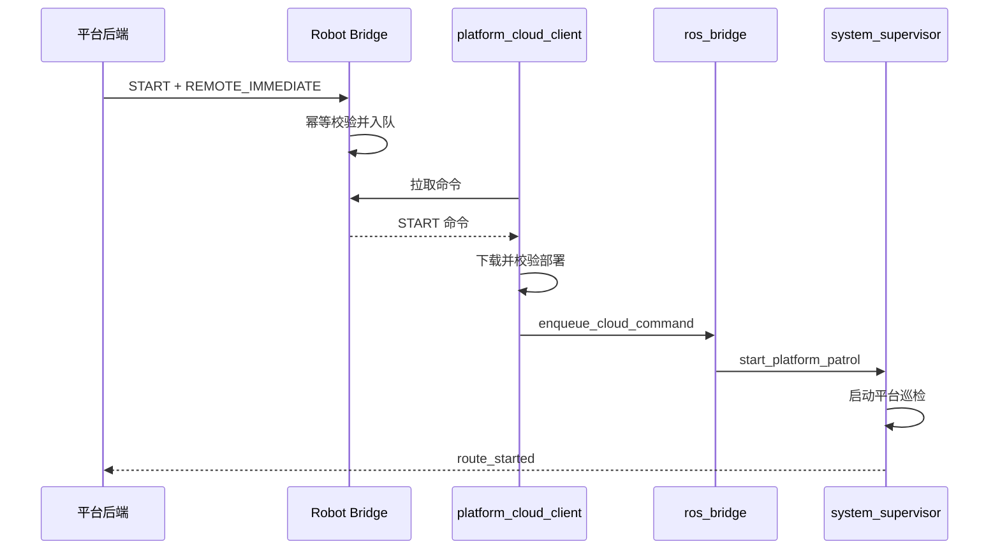
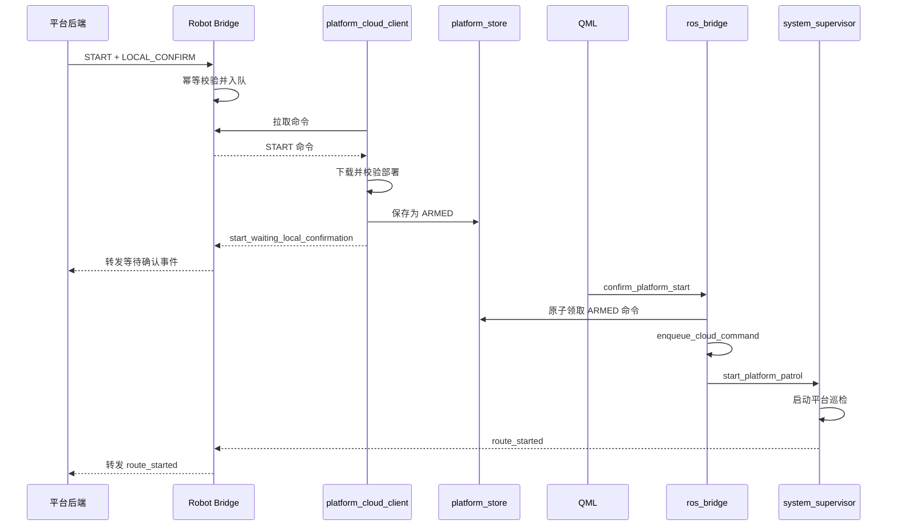

# 电力巡检机器人硬件端改造方案（含 Robot Bridge）

## 1. 文档目的

本方案用于改造机器人侧完整通信和执行链路，在保留平台远程立即启动能力的基础上，新增机器人触摸屏本地确认启动。

本文档所称“硬件端”包含：

- 软件仓库中的 Robot Bridge；
- Jetson 平台云客户端；
- 机器人本地命令持久化；
- ROS Bridge；
- System Supervisor；
- UI Backend；
- QML 触摸屏页面。

本方案不包含实体按钮、GPIO 节点或新增机械按键。

本次硬件仓库核对基于提交 `4b7c131b4fbcf6ad96b86c18c91bcd555d95571d`。硬件端当前使用 Python、SQLite、ROS 2 和 PyQt/QML；本文中的新增方法是改造要求，不代表该提交已经具备本地确认功能。

---

## 2. 改造目标

机器人侧支持两种启动模式：

| 启动方式 | 枚举值 | 机器人行为 |
|---|---|---|
| 远程立即启动 | `REMOTE_IMMEDIATE` | 校验成功后立即进入现有平台巡检执行链路 |
| 本地确认启动 | `LOCAL_CONFIRM` | 校验成功后持久化为待确认任务，触摸屏确认后再启动 |

同时保留原有机器人本地自主巡逻：

```text
start_patrol_mode
```

平台任务本地确认必须使用：

```text
start_platform_patrol
```

不能调用普通本地巡逻逻辑，否则可能丢失平台执行上下文。

能力开关要求：软件端历史机器人记录默认 `supportsLocalConfirmStart=false`。只有硬件完成无运动协议测试、触摸屏确认测试和现场安全验收后，才将该机器人能力改为 `true`；在此之前平台必须拒绝 `LOCAL_CONFIRM`，不能仅因代码已部署就开放入口。

---

## 3. 代码范围

### 3.1 软件仓库中的 Robot Bridge

仓库：

```text
Intelligent-Power-Inspection
```

主要文件：

```text
integration/robot-bridge/app/main.py
```

### 3.2 机器人仓库

仓库：

```text
electric-power-inspection-robot
```

主要文件：

```text
src/ylhb_mobile_bridge/ylhb_mobile_bridge/platform_cloud_client.py
src/ylhb_mobile_bridge/ylhb_mobile_bridge/platform_store.py
src/ylhb_mobile_bridge/ylhb_mobile_bridge/ros_bridge.py
src/ylhb_llm/ylhb_llm/ui_backend.py
src/ylhb_llm/ylhb_llm/system_supervisor_node.py
src/ylhb_llm/qml/pages/PatrolPage.qml
src/ylhb_mobile_bridge/ylhb_mobile_bridge/mobile_bridge_server.py
```

---

## 4. 启动模式协议

平台请求体增加：

```json
{
  "startMode": "LOCAL_CONFIRM"
}
```

支持：

```text
REMOTE_IMMEDIATE
LOCAL_CONFIRM
```

兼容行为：

- 缺少 `startMode` 时按 `REMOTE_IMMEDIATE`；
- 未知值拒绝并上报 `INVALID_START_MODE`；
- Robot Bridge 和机器人端必须原样保留该字段；
- 不得根据页面文案或本地配置推断启动模式。

平台调用 Bridge 的请求示例（平台请求使用 camelCase）：

```json
{
  "robotId": "robot-01",
  "requestId": "req-123",
  "taskId": "task-123",
  "executorRouteId": "route-123",
  "startMode": "LOCAL_CONFIRM",
  "profile": "inspection"
}
```

Bridge 写入队列并在 heartbeat 响应中返回扁平命令；`commandId` 由 Bridge 生成，机器人不能自行生成或要求平台预先传入：

```json
{
  "commandId": "cmd-generated-by-bridge",
  "requestId": "req-123",
  "type": "START",
  "executionId": "exec-123",
  "deploymentId": "dep-123",
  "leaseToken": "短期租约值",
  "taskId": "task-123",
  "executorRouteId": "route-123",
  "routeRevisionId": "revision-123",
  "startMode": "LOCAL_CONFIRM",
  "profile": "inspection"
}
```

上例中的 `leaseToken` 只用于机器人向 Bridge ACK，不能写入事件或日志。当前平台 START payload 没有保证提供 `taskName`、`routeName`；触摸屏展示应优先使用可选字段，缺失时回退到 `taskId`、`executorRouteId`，不能用展示名称做执行匹配。

执行身份：

```text
commandId（由 Bridge 生成）
requestId
executionId
deploymentId
executorRouteId
```

展示字段：

```text
taskName
routeName
```

任务名称和路线名称不能用于执行匹配。

---

## 5. 总体流程

### 5.1 远程立即启动



### 5.2 本地确认启动



---

## 6. Robot Bridge 改造

涉及文件：

```text
integration/robot-bridge/app/main.py
```

Robot Bridge 归入本硬件端文档，因为它是平台与机器人之间的通信边界，并直接参与机器人命令入队、拉取和事件转发。

### 6.1 START 命令接收

接收平台 START 命令时：

1. 校验平台请求中的 `requestId`、`robotId`、`executionId`、`deploymentId` 和动作类型；
2. 由 Bridge 生成 `commandId`，并在队列中持久化 `commandId` 与 `requestId` 的唯一关系；
3. 读取并验证 `startMode`；
4. 缺失时补为 `REMOTE_IMMEDIATE`；
5. 原样保存 Payload；
6. 执行幂等检查；
7. 将命令放入机器人拉取队列；
8. 不修改启动模式；
9. 不直接决定机器人是否启动。

伪代码：

```python
start_mode = payload.get(
    "startMode",
    "REMOTE_IMMEDIATE",
)

if start_mode not in {
    "REMOTE_IMMEDIATE",
    "LOCAL_CONFIRM",
}:
    raise InvalidCommand("INVALID_START_MODE")

queue_command(
    command_id=command_id,
    request_id=request_id,
    execution_id=execution_id,
    deployment_id=deployment_id,
    payload=payload,
)
```

### 6.2 幂等

相同命令重复到达时：

- 已入队：返回已有结果；
- 已被机器人拉取：不重复入队；
- 已完成：返回最终状态；
- 已失败：返回原失败结果。

建议幂等身份：

```text
commandId
requestId
executionId
deploymentId
```

除请求幂等外，Bridge 必须做机器人维度的活动 START 防御：同一机器人已有 `CREATED`、`DISPATCHING`、`RUNNING`、`PAUSED` 或 `MANUAL_TAKEOVER` execution 时拒绝新的 START。不能只依赖 Spring 的活动任务检查，因为重试、跨版本调用或人工联调可能绕过平台入口。

### 6.3 命令拉取

机器人拉取命令时，Robot Bridge 必须完整返回：

```text
commandId
requestId
type
executionId
deploymentId
leaseToken
startMode
executorRouteId
```

heartbeat 响应不保证包含 `robotId`；机器人身份由鉴权配置和 heartbeat 请求自身的 `robotId` 确认。命令字段为扁平结构，不能按 `commandType` 或嵌套 `payload` 读取。

不能丢失 `startMode`。

### 6.4 事件接收和转发

Robot Bridge 需要支持：

```text
start_waiting_local_confirmation
local_start_confirmed
route_started
route_failed
command_failed
```

`start_waiting_local_confirmation` 必须加入 START 事件白名单，并保持 Bridge execution 在活动但未运行的 `DISPATCHING`；`local_start_confirmed` 仅作为审计事件，不把 execution 推进到 `RUNNING`。只有 `route_started` 能将 execution 置为 `RUNNING`。

事件转发时使用协议的 snake_case 字段（不是命令的 camelCase 字段）：

```text
schema_version
robot_id
boot_id
sequence
event
command_id
request_id
execution_id
deployment_id
occurred_at
```

`sequence` 在硬件端由 `PlatformStore` 持久化生成，Bridge 当前按 `(robot_id, sequence)` 去重；`boot_id` 只用于诊断。`startMode` 是命令字段，事件如需审计可放入扩展字段，但不能替代上述标准事件字段。

Robot Bridge 不负责把事件映射为平台任务状态，只负责协议校验、幂等和转发。

### 6.5 Robot Bridge 日志

建议日志事件：

| 日志事件 | 级别 |
|---|---|
| `bridge_command_received` | INFO |
| `bridge_command_queued` | INFO |
| `bridge_command_delivered` | INFO |
| `bridge_duplicate_command_ignored` | DEBUG |
| `bridge_invalid_start_mode` | WARN |
| `bridge_robot_event_received` | INFO/DEBUG |
| `bridge_robot_event_forwarded` | INFO |
| `bridge_robot_event_forward_failed` | ERROR |

日志字段：

```text
commandId
requestId
executionId
deploymentId
robotId
type
startMode
event
```

不得记录：

- Authorization Header；
- 机器人 Token；
- 完整部署下载地址；
- 完整命令 Payload；
- 完整事件原文。

异常日志使用：

```python
logger.exception(...)
```

或：

```python
logger.error(..., exc_info=True)
```

---

## 7. platform_cloud_client.py 改造

涉及文件：

```text
src/ylhb_mobile_bridge/ylhb_mobile_bridge/platform_cloud_client.py
```

当前实现的入口是 `PlatformCloudClient._handle_command()`，先由 `PlatformStore.receive_cloud_command()` 持久化并 ACK，再由 `_enqueue(record)` 下载/校验部署并调用 `ros_bridge.enqueue_cloud_command()`。改造后只在 START 分支按 `startMode` 分流。

伪代码：

```python
record = self.store.receive_cloud_command(command)
start_mode = record["payload"].get(
    "startMode",
    "REMOTE_IMMEDIATE",
)

deployment = self._download_deployment(record["deployment_id"])
record["payload"] = {
    **record["payload"],
    "routePath": deployment["routePath"],
    "mapYamlPath": deployment["mapYamlPath"],
}

if start_mode == "REMOTE_IMMEDIATE":
    self._enqueue(record)

elif start_mode == "LOCAL_CONFIRM":
    self.store.arm_start_command(record["command_id"])
    self._emit_platform_event("start_waiting_local_confirmation", record)

else:
    self.store.set_command_state(record["command_id"], "REJECTED")
    self._emit_command_failed(record, code="INVALID_START_MODE")
```

伪代码中的 `arm_start_command`、`_emit_platform_event` 是待新增的局部方法；不要照搬不存在的 `_download_and_validate_deployment()` 或嵌套 `payload` 接口。部署下载实际由 `_download_deployment()` 完成，远程分支仍调用现有 `_enqueue(record)`。

### 7.1 LOCAL_CONFIRM 必须执行

1. 下载部署；
2. 校验部署 ID；
3. 校验路线版本；
4. 校验地图身份和哈希；
5. 校验执行上下文；
6. 持久化命令；
7. 状态设置为 `ARMED`；
8. 上报等待本地确认；
9. 不调用 `enqueue_cloud_command`；
10. 不发布 `start_platform_patrol`。

哈希实现现状：软件 Bridge 在 `integration/robot-bridge/app/main.py:154-162` 对 `executorJson` 调用 Python `canonical()`，硬件 `src/ylhb_mobile_bridge/ylhb_mobile_bridge/platform_store.py:193-200` 对解析后的 JSON 调用 `canonical_json()`；两端均为规范化 JSON 哈希，并非“原始 HTTP 字节 vs canonical JSON”。实施验收必须使用同一条路线样本核对 Java/Python canonical JSON 的键排序、数字、数组和 Unicode 序列化结果。

### 7.2 REMOTE_IMMEDIATE

保持现有执行链路：

```text
下载和校验
-> enqueue_cloud_command
-> start_platform_patrol
```

---

## 8. platform_store.py 改造

涉及文件：

```text
src/ylhb_mobile_bridge/ylhb_mobile_bridge/platform_store.py
```

新增状态：

```text
ARMED
```

状态转换：

```text
RECEIVED -> ACKED

ACKED -> ARMED
ACKED -> DISPATCHED
ACKED -> REJECTED
ACKED -> FAILED

ARMED -> DISPATCHED
ARMED -> REJECTED
ARMED -> FAILED

DISPATCHED -> APPLIED
DISPATCHED -> REJECTED
DISPATCHED -> FAILED
```

### 8.1 ARMED 语义

`ARMED` 表示：

- 平台命令已接收；
- 部署已下载；
- 路线和地图已校验；
- 尚未进入 ROS 执行队列；
- 等待触摸屏确认；
- 可以被平台取消；
- 可以在重启后恢复。

这是现有 `processed_commands` 表上的扩展状态，不要创建第二套命令 Store。必须扩展 `COMMAND_TRANSITIONS`；`pending_cloud_commands()` 不能把 `ARMED` 返回给自动恢复 dispatch，否则重启会绕过人工确认。另增“查询唯一 ARMED START、原子 claim、取消、超时失败”方法，查询和状态变更都使用同一 SQLite 事务。

### 8.2 建议方法

```python
def arm_start_command(self, command_id):
    ...

def get_armed_start_command(self):
    ...

def claim_armed_start_command(self, command_id):
    ...

def cancel_armed_start_command(self, execution_id):
    ...

def has_armed_start_command(self):
    ...
```

### 8.3 原子确认

确认时必须用事务或条件更新：

```sql
UPDATE processed_commands
SET state = 'DISPATCHED'
WHERE command_id = ?
  AND state = 'ARMED';
```

只有受影响行数为 1 时允许继续启动。

重复点击：

```text
ALREADY_CONFIRMED
```

### 8.4 持久化字段

现有 `processed_commands` 表可继续保存：

```text
command_id
request_id
execution_id
deployment_id
command_type
payload_json
state
```

建议补充（只有确实需要独立查询时间时才新增 SQLite 列，需兼容旧数据库）：

```text
start_mode
armed_at
```

当前实现已将 `startMode` 保存在 `payload_json`；`armed_at` 可复用 `updated_at`，或通过一次向后兼容的 SQLite schema 初始化迁移增加，不能假设存在 Flyway。

### 8.5 单任务约束

同一机器人最多允许：

```text
1 个 ARMED START
```

新的本地启动命令在已有待确认任务时返回：

```text
PENDING_START_EXISTS
```

---

## 9. ros_bridge.py 改造

涉及文件：

```text
src/ylhb_mobile_bridge/ylhb_mobile_bridge/ros_bridge.py
```

新增职责：

1. 向 UI Backend 暴露待确认任务摘要（可通过现有状态发布机制扩展）；
2. 提供本地确认 ROS 服务；当前提交只已有云/本地 APP 开关服务，确认服务需要新增，不能假定已存在；
3. 原子领取 ARMED 命令；
4. 将原平台命令送入现有云命令队列；
5. 继续复用 `_drain_cloud_commands()`；
6. 继续映射为 `start_platform_patrol`。

### 9.1 确认服务

建议新增：

```text
/mobile_bridge/confirm_platform_start
```

服务类型：

```text
std_srvs/srv/Trigger
```

因为同一时间最多一个待确认任务。

### 9.2 服务处理

```python
# armed 为 PlatformStore 返回的字典；以下是待实现的确认服务伪代码
def _handle_confirm_platform_start(
    self,
    request,
    response,
):
    armed = self.platform_store.get_armed_start_command()

    if armed is None:
        response.success = False
        response.message = "NO_PENDING_PLATFORM_START"
        return response

    if not self._robot_is_idle():
        response.success = False
        response.message = "ROBOT_BUSY"
        return response

    if not self._deployment_files_exist(armed):
        self.platform_store.fail_armed_start(
            armed.command_id,
            "DEPLOYMENT_NOT_FOUND",
        )
        response.success = False
        response.message = "DEPLOYMENT_NOT_FOUND"
        return response

    claimed = self.platform_store.claim_armed_start_command(
        armed.command_id
    )

    if not claimed:
        response.success = True
        response.message = "ALREADY_CONFIRMED"
        return response

    command = {
        **armed["payload"],
        "commandId": armed["command_id"],
        "requestId": armed["request_id"],
        "type": armed["command_type"],
        "executionId": armed["execution_id"],
        "deploymentId": armed["deployment_id"],
    }
    deployment = self.platform_store.deployment(armed["deployment_id"])
    command.update({
        "routePath": deployment["routePath"],
        "mapYamlPath": deployment["mapYamlPath"],
    })
    self.enqueue_cloud_command(command)

    response.success = True
    response.message = "PLATFORM_START_CONFIRMED"
    return response
```

### 9.3 确认前检查

- 机器人空闲；
- 待确认命令仍为 `ARMED`；
- 平台未取消；
- 执行身份完整；
- 部署目录存在；
- 路线文件存在；
- 地图 YAML 存在；
- 路线版本未变化；
- 地图身份未变化；
- 急停未激活；
- 导航和底盘允许启动。

### 9.4 执行链路

确认成功后不要直接调用 Supervisor 内部方法。

必须继续：

```text
enqueue_cloud_command
-> _drain_cloud_commands
-> start_platform_patrol
```

这样可以保留原有上下文校验、错误上报和状态机行为。

---

## 10. UI Backend 改造

涉及文件：

```text
src/ylhb_llm/ylhb_llm/ui_backend.py
```

新增只读属性：

```text
pendingPlatformStart
hasPendingPlatformStart
pendingPlatformStartTaskName
pendingPlatformStartRouteName
pendingPlatformStartArmedAt
platformStartConfirming
```

建议 QML 可见数据：

```json
{
  "executionId": "exec-123",
  "deploymentId": "dep-123",
  "taskName": "1号站房日常巡检",
  "routeName": "一层巡检路线",
  "armedAt": "2026-07-20T10:30:00+09:00"
}
```

`taskName`、`routeName` 在当前 Bridge START 命令中不是必填字段；UI Backend 必须实现回退：`taskName` 缺失显示 `taskId`，`routeName` 缺失显示 `executorRouteId`。`executionId`、`deploymentId`、`commandId` 只用于关联和日志，不允许由 QML 编辑或提交。

禁止暴露：

- Token；
- 密钥；
- 文件绝对路径；
- 下载 URL；
- 完整 Payload；
- 数据库内部字段。

新增 Slot：

```python
@Slot(result=bool)
def confirmPlatformPatrolStart(self):
    ...
```

该 Slot 调用：

```text
/mobile_bridge/confirm_platform_start
```

新增信号：

```python
platformStartConfirmSucceeded = Signal()
platformStartConfirmFailed = Signal(str)
pendingPlatformStartChanged = Signal()
```

确认过程中禁用按钮，避免连续提交。

---

## 11. PatrolPage.qml 改造

涉及文件：

```text
src/ylhb_llm/qml/pages/PatrolPage.qml
```

### 11.1 平台待启动任务卡片

当：

```qml
backend.hasPendingPlatformStart
```

为 `true` 时显示：

```text
平台待启动任务

任务：1号站房日常巡检
路线：一层巡检路线
状态：已校验，等待本地确认
```

按钮：

```text
确认启动平台巡检
```

调用：

```qml
backend.confirmPlatformPatrolStart()
```

绝对不能调用：

```qml
backend.startPatrolMode()
```

### 11.2 确认对话框

建议文案：

```text
任务已由平台下发并完成路线、地图校验。
确认后机器人将立即开始移动。

请确认：
1. 机器人周围无人和障碍物；
2. 充电线或维护设备已移除；
3. 急停按钮处于释放状态；
4. 当前环境允许机器人运行。
```

### 11.3 保留本地自主巡逻

原按钮建议改名：

```text
启动本地巡逻任务
```

继续调用：

```qml
backend.startPatrolMode()
```

界面必须清晰区分：

- 平台待启动任务；
- 本地自主巡逻任务。

### 11.4 禁用条件

平台确认按钮在以下情况下禁用：

- 确认请求处理中；
- 机器人忙碌；
- 急停激活；
- 导航未就绪；
- 部署文件缺失；
- 平台任务已取消；
- 待确认任务已超时。

---

## 12. system_supervisor_node.py 改造

涉及文件：

```text
src/ylhb_llm/ylhb_llm/system_supervisor_node.py
```

推荐不新增 Supervisor 命令。

本地确认后继续发布：

```text
start_platform_patrol
```

Supervisor 保持职责：

- 校验平台上下文；
- 校验路线和地图；
- 启动巡检；
- 上报启动成功或失败。

必须确认：

1. `ros_bridge._drain_cloud_commands()` 将原始扁平命令转换为 Supervisor 的 `start_platform_patrol`，不要让 UI 直接调用 Supervisor；
2. `start_platform_patrol` 不清空 `platform_context`；
3. 平台上下文保留（Supervisor 内部使用 snake_case）：
   - `executionId`
   - `deploymentId`
   - `requestId`
   - 路线版本
   - 地图身份
4. 重复命令不会启动第二次；
5. 非空闲状态返回明确错误；
6. 启动失败上报平台。

不要用：

```text
start_patrol_mode
```

启动平台待确认任务。

---

## 13. mobile_bridge_server.py

涉及文件：

```text
src/ylhb_mobile_bridge/ylhb_mobile_bridge/mobile_bridge_server.py
```

推荐 QML 通过 UI Backend 和 ROS 服务完成确认，不直接调用 HTTP。

若需要本地调试接口，可选增加：

```http
POST /api/platform/patrol/confirm-start
```

要求：

- 仅本机或受信任网络可用；
- 不接收客户端提交的执行身份；
- 服务端读取唯一 ARMED 命令；
- 复用同一确认服务；
- 保持幂等。

不要让本地确认功能调用：

```text
/api/debug/patrol/start
```

因为该接口通常只启动本地巡逻，不能保证平台上下文完整。

---

## 14. 取消处理

### 14.1 平台确认前取消

机器人收到取消命令且任务处于 `ARMED`：

1. 将状态改为 `REJECTED` 或 `CANCELLED`；
2. 清除待确认状态；
3. 通知 UI Backend；
4. QML 隐藏任务卡片；
5. 上报取消结果；
6. 后续确认返回 `NO_PENDING_PLATFORM_START`。

### 14.2 确认后取消

任务已经进入 `DISPATCHED` 或运行状态：

- 走现有停止或取消流程；
- 不重新回到 `ARMED`。

---

## 15. 重启恢复

机器人服务启动时：

1. 查询 `ARMED` START；
2. 检查命令是否超时；
3. 检查部署目录；
4. 检查路线和地图；
5. 检查平台是否取消；
6. 条件有效则恢复待确认任务；
7. 条件无效则标记失败并上报。

重启恢复不能重复创建命令或重复启动。

---

## 16. 本地确认超时

建议配置：

```yaml
platform:
  local_confirm_timeout_seconds: 1800
```

软件端当前默认值是 `1800` 秒（`app.task-execution.local-confirm-timeout-seconds`）。硬件端不要单独采用 `600` 秒；发布时必须由平台和 Jetson 约定同一有效期限，并明确以平台超时为最终业务状态，机器人本地超时只负责清理 `ARMED` 和上报事件。

超时后：

1. 将 `ARMED` 改为 `FAILED` 或 `REJECTED`；
2. 清除 QML 卡片；
3. 上报：

```text
LOCAL_CONFIRM_TIMEOUT
```

4. 禁止继续确认；
5. 平台需要重新下发任务。

---

## 17. 幂等和并发

### 17.1 命令幂等

使用：

```text
commandId
requestId
executionId
deploymentId
```

相同命令重复到达：

- 已 `ARMED`：返回等待确认；
- 已 `DISPATCHED`：返回已处理；
- 已 `APPLIED`：返回已完成；
- 已失败：返回原失败结果。

### 17.2 确认幂等

- 第一次确认：`ARMED -> DISPATCHED`；
- 后续确认：返回 `ALREADY_CONFIRMED`；
- 不重复入队；
- 不重复发布 `start_platform_patrol`。

### 17.3 并发限制

同一机器人只允许：

```text
0 或 1 个 ARMED START
```

存在待确认、启动中或运行任务时，拒绝新 START。

---

## 18. 机器人事件

新增：

```text
start_waiting_local_confirmation
```

可选：

```text
local_start_confirmed
```

保留：

```text
route_started
route_failed
command_failed
```

推荐顺序：

```text
start_waiting_local_confirmation
local_start_confirmed
route_started
```

公共字段：

```json
{
  "schema_version": "1.0",
  "robot_id": "robot-01",
  "boot_id": "boot-123",
  "sequence": 42,
  "event": "start_waiting_local_confirmation",
  "command_id": "cmd-generated-by-bridge",
  "request_id": "req-123",
  "execution_id": "exec-123",
  "deployment_id": "dep-123",
  "occurred_at": "2026-07-20T10:30:00+08:00"
}
```

事件必须复用原命令身份。`sequence` 是机器人全局持久序号，Bridge 当前幂等键为 `(robot_id, sequence)`；相同序号不同 payload 必须报冲突，不能被 `INSERT OR IGNORE` 静默吞掉。

---

## 19. 日志改造

### 19.1 Robot Bridge 日志

见第 6.5 节。

### 19.2 Jetson 和 ROS 日志事件

建议：

| 日志事件 | 级别 | 说明 |
|---|---|---|
| `platform_start_command_received` | INFO | Jetson 收到 START |
| `platform_start_mode_resolved` | DEBUG | 解析启动模式 |
| `platform_deployment_validated` | INFO | 部署校验完成 |
| `platform_start_armed` | INFO | 本地启动任务进入 ARMED |
| `platform_start_waiting_event_sent` | INFO | 等待确认事件已发送 |
| `platform_start_confirm_requested` | INFO | UI 发起确认 |
| `platform_start_confirm_rejected` | WARN | 确认被拒绝 |
| `platform_start_confirmed` | INFO | ARMED 原子领取成功 |
| `platform_start_dispatched` | INFO | 命令进入 ROS 执行队列 |
| `platform_start_duplicate_confirm_ignored` | DEBUG | 重复确认忽略 |
| `platform_start_cancelled_before_confirm` | INFO | 确认前取消 |
| `platform_start_restore_succeeded` | INFO | 重启恢复成功 |
| `platform_start_restore_failed` | WARN | 重启恢复失败 |
| `platform_start_local_confirm_timeout` | WARN | 本地确认超时 |
| `platform_patrol_start_failed` | ERROR | 平台巡检启动失败 |

关联字段：

```text
commandId
requestId
executionId
deploymentId
robotId
startMode
commandState
event
```

不得记录 Token、密钥、完整下载 URL 或完整 Payload。

高频轮询和无任务扫描使用 DEBUG，不要持续输出 INFO。

---

## 20. 错误码

```text
NO_PENDING_PLATFORM_START
PENDING_START_EXISTS
INVALID_START_MODE
ROBOT_BUSY
ROBOT_NOT_READY
EMERGENCY_STOP_ACTIVE
DEPLOYMENT_NOT_FOUND
DEPLOYMENT_HASH_MISMATCH
ROUTE_FILE_NOT_FOUND
ROUTE_REVISION_MISMATCH
MAP_FILE_NOT_FOUND
MAP_IDENTITY_MISMATCH
PLATFORM_START_CANCELLED
LOCAL_CONFIRM_TIMEOUT
ALREADY_CONFIRMED
```

QML 需要转换为中文提示。

---

## 21. 测试要求

### 21.1 Robot Bridge

1. `startMode` 原样保存和转发；
2. 缺失时默认 `REMOTE_IMMEDIATE`；
3. 非法值被拒绝；
4. 重复命令不重复入队；
5. 命令拉取不丢失执行身份；
6. 新事件可转发平台；
7. 日志不泄露认证信息。

### 21.2 platform_cloud_client

1. 远程启动保持直接入队；
2. 本地启动进入 `ARMED`；
3. 本地启动不调用 `enqueue_cloud_command`；
4. 部署校验失败不显示确认；
5. 等待确认事件字段完整；
6. 重复命令不产生多个待确认任务。

### 21.3 platform_store

1. 支持 `ACKED -> ARMED`；
2. 支持 `ARMED -> DISPATCHED`；
3. 原子领取只能成功一次；
4. 重启后可恢复；
5. 平台取消可清除；
6. 单机器人只有一个 ARMED。

### 21.4 ros_bridge

1. 无待确认任务时确认失败；
2. 机器人忙碌时确认失败；
3. 文件缺失时确认失败；
4. 正常确认只入队一次；
5. 重复确认返回 `ALREADY_CONFIRMED`；
6. 最终仍发布 `start_platform_patrol`；
7. 平台上下文完整。

### 21.5 UI Backend 和 QML

1. 正确显示待确认任务；
2. 正确调用确认服务；
3. 确认期间按钮禁用；
4. 平台取消后卡片消失；
5. 平台按钮不调用 `startPatrolMode()`；
6. 本地自主巡逻仍正常；
7. 错误提示可读；
8. 连续点击不重复启动。

### 21.6 联调

#### 本地启动

1. 平台发送 `LOCAL_CONFIRM`；
2. Robot Bridge 入队；
3. Jetson 拉取并校验；
4. 命令进入 `ARMED`；
5. 平台收到等待确认事件；
6. QML 显示任务；
7. 触摸屏确认；
8. ROS Bridge 发布 `start_platform_patrol`；
9. Supervisor 启动路线；
10. 平台收到 `route_started`。

#### 远程启动

1. 平台发送 `REMOTE_IMMEDIATE`；
2. Robot Bridge 入队；
3. Jetson 校验后直接入 ROS 队列；
4. Supervisor 启动路线；
5. 平台收到 `route_started`。

#### 取消

1. 本地任务进入 `ARMED`；
2. 平台取消；
3. QML 卡片消失；
4. 确认接口返回无待启动任务；
5. 机器人不移动。

#### 重启恢复

1. 命令进入 `ARMED`；
2. 重启机器人服务；
3. Store 恢复任务；
4. QML 恢复显示；
5. 确认后只启动一次。

---

## 22. 推荐实施顺序

1. Robot Bridge 支持 `startMode` 和新事件；
2. `platform_store.py` 增加 `ARMED`；
3. `platform_cloud_client.py` 按模式分支；
4. `ros_bridge.py` 增加确认服务；
5. `ui_backend.py` 增加属性和 Slot；
6. `PatrolPage.qml` 增加平台任务卡片；
7. 检查 Supervisor 平台上下文；
8. 增加取消、超时和重启恢复；
9. 增加日志；
10. 完成单元和联调测试。

---

## 23. 验收标准

1. Robot Bridge 能完整透传两种启动模式；
2. 远程启动继续立即启动；
3. 本地启动校验完成后不会自动运动；
4. QML 能显示并确认平台待启动任务；
5. 确认后使用原平台执行上下文；
6. 平台任务不调用普通本地巡逻入口；
7. 重复确认不重复启动；
8. 取消、超时和重启恢复正确；
9. 不包含实体按钮和 GPIO 改造；
10. Robot Bridge 修改已全部归入本硬件端文档。
