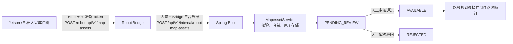

# 机器人建图地图上传与人工审核实施指南

## 1. 目标与边界

本功能用于机器人完成建图后，将一对 ROS 栅格地图文件（`*.yaml` 与 `*.pgm`）上传至平台。人工审核通过后，地图才可以被路线规划引用。

本功能**不替代**现有 Web 巡检规划页面的用户上传能力：

- 用户上传继续使用 `POST /api/v1/map-assets`，保持当前平台 JWT 与 `ROUTE_EDIT` 权限模型。
- 机器人上传使用新的设备 API `POST /robot-api/v1/map-assets`，只接受设备 Token。
- 两条入口只复用地图校验、哈希和存储服务；不得共用认证语义，也不得让机器人持有平台用户 JWT。
- 地图内容身份使用规范化地图语义与 PGM 哈希，不使用原始 YAML 哈希；Jetson 与 Spring 必须独立计算并互相核对。

本期不做以下事情：

- 不因上传成功自动替换站点当前地图、路线、路线修订或已部署任务。
- 不让浏览器、小程序或 Jetson 直接访问 Bridge 管理 API。
- 不让机器人在请求中自行指定 `robotId` 或 `siteId`。
- 不引入对象存储直传；首期继续使用平台受控文件系统存储。多实例部署时再抽象为对象存储或共享存储。

## 2. 当前基础与复用原则

后端现有地图资产实现已经提供了以下能力，应作为唯一的地图资产入库逻辑：

- `MapAssetController`：用户侧上传、下载与删除接口。
- `MapAssetService`：文件名清洗、YAML 安全解析、YAML 中 `image` 与 PGM 文件名配对、8-bit P5 PGM 头与尺寸校验、SHA-256、暂存目录原子发布、地图元数据持久化。
- `RobotBridgeIdMapper`：平台机器人 ID 与 Bridge/Jetson 设备 ID 的一对一映射。
- Robot Bridge：设备 Token 校验、Jetson 公网入口、Bridge 到 Spring 的服务端凭据调用。

机器人上传功能应新增设备入口和审核流程，最终仍调用 `MapAssetService`。不得在 Bridge 或 Jetson 再实现另一套 YAML/PGM 解析与文件存储规则。

## 3. 总体流程



机器人上传成功仅表示文件已完整、校验通过且已进入待审核队列；不表示地图已启用，更不表示机器人已加载该地图。

## 4. 地图资产状态与使用规则

| 状态 | 产生方 | 含义 | 可用于路线规划 | 可被机器人部署下载 |
| --- | --- | --- | --- | --- |
| `PENDING_REVIEW` | 机器人上传接口 | 文件和基础格式校验已通过，等待人工判断地图是否可用 | 否 | 否 |
| `AVAILABLE` | 审核通过 | 已批准，可被路线规划选择 | 是 | 仅在它被路线修订引用并创建部署后 |
| `REJECTED` | 审核驳回 | 不能用于规划，保留审核记录 | 否 | 否 |
| `DELETED` | 管理端清理 | 文件与元数据已清理或进入保留期删除 | 否 | 否 |

规则：

1. 现有的 `MapAssetService.get(id)` 继续只返回 `AVAILABLE` 地图，保障路线、部署和下载链路不会误用待审核或已驳回地图。
2. 管理端审核列表使用专用查询读取 `PENDING_REVIEW`、`REJECTED` 元数据；不得复用面向路线规划的可用地图查询。
3. 上传的新地图不会更新既有路线的 `mapAssetId`，也不会影响已有部署快照。
4. 已被路线草稿、路线修订或部署引用的 `AVAILABLE` 地图仍遵循现有删除保护。

## 5. Jetson / 机器人端改动

### 5.1 生成并持久化上传任务

机器人完成建图并得到 YAML、PGM 后，创建本地“地图上传任务”。任务至少包含：

- 本地任务 ID；
- `Idempotency-Key`（UUID v4）；
- YAML、PGM 本地路径和文件名；
- YAML、PGM 的 SHA-256；
- 建图完成时间 `capturedAt`；
- 持久状态：`PENDING`、`FAILED_RETRYABLE`、`FAILED_FINAL`、`SUCCEEDED`；`UPLOADING` 只保存在单线程 worker 内存中；
- 后端返回的 `mapAssetId`（成功后写入）。

任务与文件信息必须在 Jetson 本地 SQLite 中持久化。网络失败、Jetson 进程重启或 Bridge 超时后，必须重用原任务的同一个 `Idempotency-Key` 重试。

`Idempotency-Key` 由机器人在创建上传意图时生成，Bridge 只原样转发；不得由每次 HTTP 请求临时生成，也不建议直接用文件哈希代替。

### 5.2 调用设备上传接口

```http
POST /robot-api/v1/map-assets HTTP/1.1
Authorization: Bearer <设备 Token>
Idempotency-Key: 85f30cd9-4ca6-4eb8-bb09-a8be55ac0a14
Content-Type: multipart/form-data
```

multipart 字段：

| 字段 | 必填 | 说明 |
| --- | --- | --- |
| `yaml` | 是 | ROS map_server YAML 文件，扩展名为 `.yaml` 或 `.yml` |
| `pgm` | 是 | ROS P5 PGM 文件，扩展名为 `.pgm` |
| `capturedAt` | 否 | 机器人建图完成时间，ISO-8601；只作审计信息 |
| `contentIdentitySha256` | 是 | 规范化地图内容身份 |
| `yamlSha256` | 是 | 原始 YAML 审计哈希 |
| `pgmSha256` | 是 | 原始 PGM 哈希 |

机器人不得发送或信任以下业务归属字段：`robotId`、`siteId`、`status`、`reviewer`。

成功响应示例：

```json
{
  "mapAssetId": "map_xxx",
  "status": "PENDING_REVIEW",
  "contentIdentitySha256": "<64 位十六进制哈希>",
  "yamlSha256": "<64 位十六进制哈希>",
  "pgmSha256": "<64 位十六进制哈希>",
  "width": 2048,
  "height": 1536,
  "resolution": 0.05,
  "createdAt": "2026-07-17T00:00:00Z"
}
```

首次成功返回 `201`；相同设备、相同幂等键且内容一致的重试返回 `200` 与同一 `mapAssetId`。

### 5.3 重试与错误处理

| HTTP 状态 | 行为 |
| --- | --- |
| `200` / `201` | 标记本地任务成功，保存 `mapAssetId`，停止重传 |
| `400` / `422` | 地图格式或内容无效，标记失败，等待人工处理，不自动重试 |
| `401` | 设备 Token 无效，停止重试并进入凭据故障状态 |
| `403` | 设备未绑定有效站点或无上传资格，停止重试 |
| `409` | 同一幂等键提交了不同内容，标记失败并保留本地证据 |
| `413` | 文件超过限制，标记失败 |
| `429` / `503` / 网络错误 | 上传仍在处理或服务暂时不可用；保持同一幂等键，按指数退避加抖动重试 |

规范化身份 JSON 固定包含 `pgmSha256/resolution/origin/negate/occupiedThresh/freeThresh/mode`。键排序且无空白；数值转换为无多余零的十进制字符串；缺失的 `negate/occupied_thresh/free_thresh/mode` 使用 `0/0.65/0.25/trinary`。YAML 原始哈希只作审计，不参与内容去重。

全程保持 TLS 证书校验；私有 CA 通过既有 CA 文件配置，不得关闭校验。

## 6. Robot Bridge 改动

### 6.1 新增公网设备接口

在 `integration/robot-bridge/app/main.py` 新增：

```text
POST /robot-api/v1/map-assets
```

接口必须复用既有 `token_robot(...)`：

1. 从 `Authorization` 校验设备 Token。
2. 从 Token 得到唯一的 Bridge/Jetson `robotId`。
3. 不信任 multipart 中的机器人和站点字段。
4. 校验 `Idempotency-Key` 非空且长度不超过 160。
5. 校验仅有一份 YAML 和一份 PGM，文件扩展名正确。
6. 用受控临时目录分块写入、限制大小，并在转发结束后清理临时文件。

Bridge 对公网设备 API 的成功与错误响应保持现有原始 JSON 风格，不使用 Spring `ApiResponse` 包装。错误体使用既有格式：

```json
{
  "code": "INVALID_REQUEST",
  "message": "request is invalid",
  "requestId": ""
}
```

### 6.2 转发到 Spring

Bridge 将认证后的设备 ID、幂等键与文件转发到仅供服务端使用的 Spring 接口：

```text
POST /api/v1/internal/robot-map-assets
Authorization: Bearer <Bridge 到平台的服务凭据>
X-Bridge-Robot-Id: <Bridge/Jetson robotId>
Idempotency-Key: <原样转发>
```

建议在 Bridge 显式加入 `httpx`，以文件对象进行流式 multipart 转发；禁止把 100 MB 级 PGM 完整读入内存再拼接请求体。

Bridge 不负责决定站点、审核结果、地图是否启用或路线是否替换。它只负责设备认证、大小保护和可靠转发。

### 6.3 Bridge 验证与部署

- 在 `smoke.py` 覆盖正常上传、缺失/错误 Token、重复幂等键、不同内容同键、YAML/PGM 缺失和超限文件。
- 保持 Bridge 管理 API 仅监听回环地址；Nginx 仅公开 `/robot-api/`。
- 生产 Nginx 的 `client_max_body_size` 至少为 110 MB，并与 Spring 的 multipart 限制一并核对。
- 日志只能记录 robotId、幂等键的脱敏摘要、状态码、文件大小和地图资产 ID；禁止记录 Authorization、Token 或完整环境变量。

## 7. Spring Boot 后端改动

### 7.1 新增内部接收接口

新增独立 Controller，例如：

```text
POST /api/v1/internal/robot-map-assets
```

职责：

1. 用常量时间比较校验 Bridge 平台凭据。
2. 读取 `X-Bridge-Robot-Id`，经 `RobotBridgeIdMapper` 转为平台 `robotId`。
3. 查询平台机器人记录，要求机器人存在且已绑定有效 `siteId`。
4. 忽略客户端站点信息，以机器人所属站点作为地图资产 `siteId`。
5. 调用新的 `MapAssetService.createForRobot(...)`。
6. 返回待审核地图资产元数据。

该内部路径可以在 Spring Security 中放行到 Controller，但 Controller 内部必须强制进行 Bridge 服务凭据校验。它绝不能接受平台用户 JWT 作为替代，也不能暴露给公网反向代理。

### 7.2 扩展地图资产服务

在 `MapAssetService` 增加机器人入口专用方法；复用现有下列校验：

- YAML 最大 1 MB，PGM 最大 100 MB；
- 安全 YAML 解析、禁止重复键与别名展开；
- `image` 必须匹配上传 PGM 的安全 basename；
- `resolution`、`origin`、阈值、`mode`、`negate` 校验；
- 只接受 8-bit `P5` PGM，检查宽、高、最大灰度和像素数据长度；
- YAML/PGM SHA-256；
- 暂存目录写入成功后原子发布。

机器人上传创建的元数据至少增加：

| 字段 | 说明 |
| --- | --- |
| `status` | 初始恒为 `PENDING_REVIEW` |
| `source` | 恒为 `ROBOT` |
| `sourceRobotId` | 平台机器人 ID |
| `sourceBridgeRobotId` | Bridge/Jetson 设备 ID |
| `uploadIdempotencyKey` | 原始幂等键，审计用途 |
| `capturedAt` | 机器人上报的建图完成时间，可为空 |
| `reviewedBy` / `reviewedAt` | 审核完成后写入 |
| `reviewComment` | 审核意见 |

建议将允许的 YAML 顶层字段显式收敛为 ROS 地图需要的字段：`image`、`resolution`、`origin`、`negate`、`occupied_thresh`、`free_thresh`、`mode`。若需要兼容厂商扩展，应记录扩展字段策略后再放行。

### 7.3 幂等持久化

为可靠处理弱网重传，新增独立 JPA 实体、Repository 与 Flyway 迁移，例如 `robot_map_uploads`：

| 字段 | 约束/用途 |
| --- | --- |
| `robot_id` | 平台机器人 ID |
| `idempotency_key` | 与 `robot_id` 组成唯一约束 |
| `yaml_sha256` / `pgm_sha256` | 原始文件审计哈希 |
| `content_identity_sha256` | V13 新增；规范化内容身份，旧记录为空时回退原始哈希兼容 |
| `map_asset_id` | 创建成功后关联的地图资产 |
| `status` | `PROCESSING`、`SUCCEEDED`、`FAILED` |
| `created_at` / `updated_at` | 审计与故障恢复 |

处理规则：

1. 首次请求先声明或获取上传记录。
2. 同键且哈希一致：若已成功，返回原地图；若处理中，返回 `503` 可重试语义；若失败或处理记录超时，原请求可原子接管后重试。
3. 同键但任一哈希不同：返回 `409`，不创建新资产。
4. 创建资产成功后写入 `map_asset_id` 并标记成功。
5. 文件发布后数据库写入失败时清理未关联目录；进程异常遗留的临时目录应可在启动或定时任务中回收。

不能仅依赖 `DataStoreService.list(...)` 查询旧地图做幂等，因为它不能提供并发唯一性保证。

### 7.4 人工审核 API

新增管理端接口：

```text
GET  /api/v1/map-assets?source=ROBOT&status=PENDING_REVIEW&siteId=<可选>
POST /api/v1/map-assets/{id}/review
```

审核请求示例：

```json
{
  "action": "APPROVE",
  "comment": "地图边界与现场一致，可用于路线规划"
}
```

`action` 仅允许 `APPROVE` 或 `REJECT`：

- `APPROVE`：`PENDING_REVIEW -> AVAILABLE`。
- `REJECT`：`PENDING_REVIEW -> REJECTED`，必须填写审核意见。
- 已审核资产禁止重复审核；如需重审，必须定义单独的业务流程与审计记录，不能静默覆盖。
- 驳回后立即清理 YAML/PGM 大文件，保留审核元数据；管理端仍可查看审计信息，但不再提供文件下载。
- 驳回元数据和对应幂等记录默认保留 30 天，之后定时清理。保留期内旧 key 始终返回原驳回结果；新的上传意图必须使用新 key。

审核人至少需要现有 `ROUTE_EDIT` 权限。若后续审计要求更严格，可新增专用 `MAP_REVIEW` 权限；首期不必引入额外角色体系。

### 7.5 路线规划访问控制

- 路线规划可选择的地图列表只返回 `AVAILABLE`。
- 路线草稿、路线修订和部署继续调用 `ensureAvailableForSite(...)`，禁止关联 `PENDING_REVIEW` 或 `REJECTED`。
- 地图审核通过后，用户仍需在路线规划界面主动选择它并发布新的路线修订；审核本身不改变任何路线。

## 8. Web 管理端改动

在 Vue Web 管理端新增“机器人建图审核”入口，可放在路线规划或站点管理下。

### 8.1 待审核列表

列表展示：

- 地图资产 ID、站点、来源机器人、上传时间、建图时间；
- YAML/PGM 文件名、尺寸、分辨率、宽高、SHA-256 摘要；
- 状态与审核意见；
- 预览/下载 YAML、PGM；
- 通过、驳回按钮。

仅具有 `ROUTE_EDIT` 权限的用户显示审核操作。查看用户只能查看授权范围内的列表和审核结果。

### 8.2 审核操作

- 审核前显示 PGM 预览及 YAML 核心参数。
- 通过前二次确认，提示“不会自动替换现有路线或部署”。
- 驳回时要求填写原因。
- 提交成功后刷新列表；只有 `AVAILABLE` 地图出现在路线规划的地图选择器中。

现有用户本地上传流程不修改其入口和交互；如它创建的资产仍为 `AVAILABLE`，应在类型与来源标识上保持 `source=USER` 或等价语义。

## 9. 小程序、AI 服务与契约文档

### 9.1 微信小程序

首期不提供小程序审核能力，不直接访问 Bridge，也不上传机器人地图。若需要展示地图，只读取通过审核且授权可见的 `AVAILABLE` 地图。

### 9.2 AI 服务

本功能不调用 AI 服务，不需要变更 `ai-services/`。

### 9.3 文档与契约

实施时更新：

- `docs/protocol/robot-platform-v1.md`：新增设备上传端点、幂等规则、审核状态含义；保持协议主版本兼容，新增字段和端点使用向后兼容方式。
- `docs/apifox-openapi.json`：记录管理端审核接口及地图资产状态字段；机器人 Bridge API 可在 Bridge 文档或专用 OpenAPI 中维护。
- `docs/integration/README.md`：增加本指南链接。
- Robot 仓库的同路径协议副本：按既有流程保持字节一致。

文档示例仅使用 `token-placeholder` 等占位符，不得写入真实 Token、地址、账号或环境变量内容。

## 10. 配置、存储与运维改动

| 组件 | 改动 |
| --- | --- |
| Jetson | 本地 SQLite 上传任务表、任务文件保留与退避重试 |
| Robot Bridge | 上传临时目录、分块大小限制、`httpx` 依赖、设备上传日志脱敏 |
| Nginx | 仅代理 `/robot-api/`，保留至少 110 MB `client_max_body_size` 与合适的上传/读取超时 |
| Spring Boot | multipart 限制与 Bridge 限制一致；新增内部认证、幂等迁移和审核 API |
| 文件系统 | 地图文件继续位于受控 `runtime-storage/map-assets/`，禁止通过通用静态文件目录直接公开待审核地图 |
| 驳回保留 | YAML/PGM 驳回后立即清理；元数据和幂等记录按 `MAP_ASSET_REJECTED_RETENTION_DAYS` 到期清理 |

新配置项必须以环境变量或受保护的部署配置注入。Token 不得写入仓库、前端包、日志、接口响应或本文档。

## 11. 测试与验收清单

### 11.1 Robot Bridge smoke 测试

- 正确设备 Token 上传有效 YAML+PGM，收到 `201` 与 `PENDING_REVIEW`。
- 缺失、未知或与请求身份不匹配的 Token 返回 `401`。
- 缺少任一文件、错误扩展名、超限文件返回 `400` 或 `413`。
- 同一幂等键、同内容重复上传返回同一资产。
- 同一幂等键、不同内容返回 `409`。
- Bridge 转发失败时临时文件被清理，机器人后续仍可用相同幂等键重传。

### 11.2 Spring Boot 测试

- Bridge 凭据错误或未知映射设备不可调用内部接口。
- 设备未绑定站点时拒绝创建资产。
- YAML 与 PGM 文件名不匹配、非法 YAML、非法 PGM、阈值错误、像素数据不足均被拒绝。
- 创建成功的资产记录 `source=ROBOT`、机器人归属、哈希与 `PENDING_REVIEW`。
- 幂等唯一约束在并发请求下只生成一个地图资产。
- 审核通过后路线规划可关联；驳回或待审核时关联失败。
- 审核不改变既有路线修订和部署。

### 11.3 管理端验证

- 待审核地图可查看元数据与预览。
- 审核通过和驳回均有确认、权限校验与审核记录。
- 路线规划选择器不展示 `PENDING_REVIEW`、`REJECTED` 地图。
- 原有用户上传和路线规划回归可用。

### 11.4 建议执行命令

```powershell
# 后端
cd backend
mvn test

# Bridge
cd integration/robot-bridge
python3 smoke.py

# Web 管理端
cd frontend/web
npm run build
```

若后端存在既有编译失败，应先记录基线并区分本功能引入的问题与已有问题。

## 12. 上线顺序与回滚

1. 先发布 Spring 的数据库迁移、内部接收接口和审核 API，但不开放机器人上传入口。
2. 发布 Web 审核页面，验证待审核资产不能进入路线规划。
3. 发布 Bridge 上传转发与 smoke 测试，确认 Bridge 仍只对公网开放 `/robot-api/`。
4. 发布 Jetson 本地上传任务与小范围设备灰度。
5. 用一台测试机器人完成“建图 → 上传 → 审核 → 路线规划 → 部署下载哈希校验”的闭环。

回滚时先停止 Nginx 对新上传路径的暴露或在 Bridge 关闭新路由，再停止 Jetson 上传开关。已存在的 `PENDING_REVIEW` 资产保持不可用于路线规划，因此回滚不会改变线上已部署路线或触发机器人运动。
