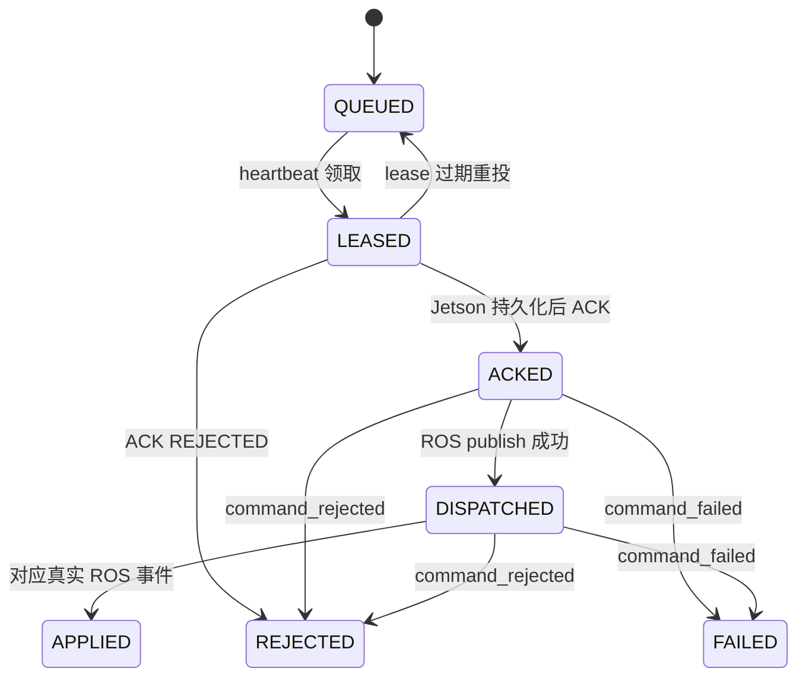
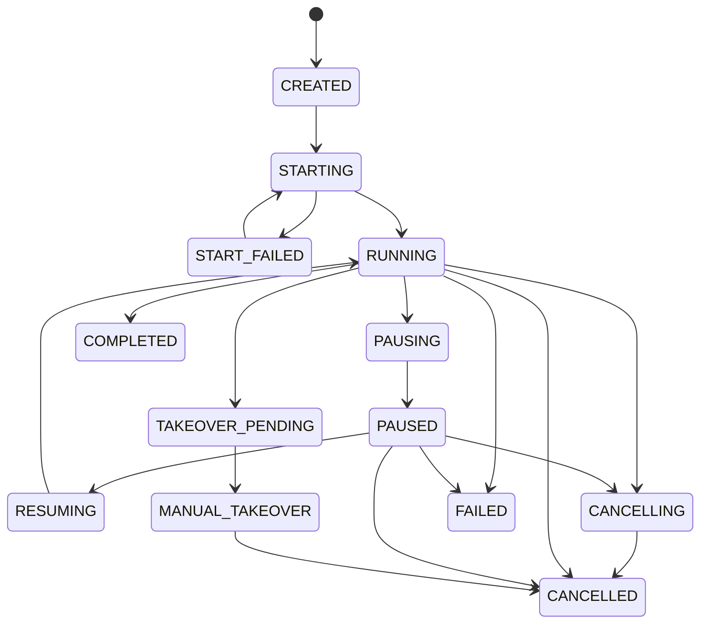

# 状态与事件合同

> 本文用于跨团队快速对照，不重新定义协议。字段、合法迁移和错误码以 [Robot Platform Protocol v1](../protocol/robot-platform-v1.md) 为准。

## 1. Command 状态机



服务器 SQLite 直接观察 QUEUED、LEASED、ACKED 与结果终态；DISPATCHED 是 Jetson 本地持久状态。后端不能因服务器仍显示 ACKED 就重建新 command。

## 2. Execution 状态机



`COMPLETED/FAILED/CANCELLED` 为终态。`START_FAILED` 可由用户重新发起 START；任何晚到事件不得回退真正终态。

## 3. Task 状态映射

| Bridge | 平台 Task | UI |
| --- | --- | --- |
| `CREATED` | `CREATED` | 待下发 |
| `DISPATCHING` | `STARTING` | 启动中 |
| `RUNNING` | `RUNNING` | 巡检中 |
| `PAUSED` | `PAUSED` | 已暂停 |
| `MANUAL_TAKEOVER` | `MANUAL_TAKEOVER` | 人工接管 |
| `COMPLETED` | `COMPLETED` | 已完成 |
| `FAILED` | `FAILED` | 执行失败 |
| `CANCELLED` | `CANCELLED` | 已取消 |

## 4. Robot 在线状态

| 状态 | 定义 | UI 动作 |
| --- | --- | --- |
| `ONLINE` | Spring 整合的 Bridge robot `online=true` | 可按任务状态启用控制 |
| `OFFLINE` | 最后心跳超过 12 秒或明确离线 | 禁止新 dispatch，提示未在线 |
| `UNKNOWN` | Bridge 不可达、尚无心跳或同步未完成 | 显示未知，不猜测 online |

online 不是巡检可运行的充分条件；START 前仍需 deployment READY、robot idle、安全与 ROS 健康检查。

## 5. 事件字段

| 字段 | 类型 | 说明 |
| --- | --- | --- |
| `schema_version` | string | 固定 `1.0` |
| `robot_id` | string | 事件所有者 |
| `boot_id` | string | 事件生成进程 |
| `sequence` | integer | robot 全局递增 |
| `event` | string | 事件类型 |
| `execution_id` | string | execution |
| `deployment_id` | string | deployment |
| `request_id` | string | 本次控制意图 |
| `command_id` | string | 结果归属 command |
| `occurred_at` | string | UTC ISO-8601 |
| `error_code` | string/null | 稳定错误码 |
| `error_message` | string/null | 已脱敏消息 |
| `payload` | object/null | 目标、进度、检测等扩展 |

## 6. 事件类型

| Robot event | Command 影响 | Execution 影响 | 平台事件 |
| --- | --- | --- | --- |
| `command_accepted` | 无结果终态 | 无 | 可记录诊断 |
| `initial_pose_published` | 无结果终态 | 无 | 可记录初始化 |
| `route_started` | START→APPLIED | RUNNING | DISPATCH/START |
| `target_reached` | START 保持 APPLIED | RUNNING | ARRIVE |
| `target_task_started` | START 保持 APPLIED | RUNNING | INSPECT |
| `target_task_finished` | START 保持 APPLIED | RUNNING | DETECT/INSPECT_RESULT |
| `return_home_started` | START 保持 APPLIED | RUNNING | 可记录返航 |
| `route_paused` | PAUSE→APPLIED | PAUSED | PAUSE |
| `route_resumed` | RESUME→APPLIED | RUNNING | RESUME |
| `manual_takeover` | TAKEOVER→APPLIED | MANUAL_TAKEOVER | TAKEOVER |
| `route_finished` | START 已应用 | COMPLETED | COMPLETE |
| `route_failed` | 必要时生成 command_failed | FAILED | ERROR |
| `route_canceled` | CANCEL→APPLIED | CANCELLED | CANCEL |
| `command_rejected` | 对应 command→REJECTED | START 时可 FAILED | ERROR |
| `command_failed` | 对应 command→FAILED | START 时可 FAILED | ERROR |

## 7. Sequence 处理

1. Jetson SQLite 分配 sequence，跨 execution 不归零。
2. Bridge 以 `(robotId, sequence)` 去重。
3. Bridge 只应用已连续确认区间；缺口后的事件可保存但不推进状态。
4. Spring 使用 `afterSequence` 排他查询，并在事务成功后保存 cursor。
5. STOMP 只在事务提交后发送；前端按业务 event ID 去重。
6. 终态检查必须先于状态迁移，重复/晚到事件只作审计，不改变终态。

## 8. 错误传播

```text
Jetson error_code/error_message
  -> Bridge execution.lastError / event
  -> Spring TaskExecutionEntity.lastErrorCode/lastErrorMessage
  -> Spring ApiResponse/STOMP 的脱敏用户消息
  -> 前端状态与时间线
```

Token、Authorization、JWT、服务器内部 URL userinfo/query、堆栈和完整 env 不得进入该链路。

## 9. HTTP 202、ACK、DISPATCHED、APPLIED

| 信号 | 能证明 | 不能证明 |
| --- | --- | --- |
| HTTP `202` | Bridge 已把 command 持久入队 | robot 在线、已领取、ROS 已执行 |
| `LEASED` | robot heartbeat 已领取当前租约 | Jetson 已持久化 |
| ACK / `ACKED` | Jetson 已把 command 持久化 | ROS publish 成功、动作生效 |
| `DISPATCHED` | Jetson 已成功 publish ROS command 并持久记录 | Patrol executor 已应用 |
| `APPLIED` | 收到与 command 对应的真实 ROS 结果事件 | 整条路线最终完成 |

禁止仅根据 HTTP `202` 判定功能成功。

## 10. 完整时间线示例

| 步骤 | 动作 | Bridge command | Execution | 平台/UI |
| ---: | --- | --- | --- | --- |
| 1 | 后端创建 START，持久化 requestId | - | CREATED | Task CREATED |
| 2 | Bridge 接收管理请求 | QUEUED | STARTING | HTTP 202；显示等待机器人确认 |
| 3 | Jetson heartbeat 领取 | LEASED | STARTING | 仍启动中 |
| 4 | leaseToken 随命令返回 | LEASED | STARTING | 无变化 |
| 5 | Jetson 持久化并 ACK | ACKED | STARTING | 无变化 |
| 6 | Bridge 接收 ACK | ACKED | STARTING | 无变化 |
| 7 | Jetson ROS publish | Jetson DISPATCHED | STARTING | 无变化 |
| 8 | Jetson 持久化 DISPATCHED | Jetson DISPATCHED | STARTING | 无变化 |
| 9 | Patrol 产生 `route_started` | 等待事件上传 | STARTING | 无变化 |
| 10 | Bridge 连续应用事件 | APPLIED | RUNNING | 后端轮询可见 |
| 11 | Spring 事务更新 task | APPLIED | RUNNING | Task RUNNING |
| 12 | Spring 发布 STOMP | APPLIED | RUNNING | 推送 task/event |
| 13 | 前端替换 Store | APPLIED | RUNNING | 显示“巡检中” |

## 11. 终态保护检查

- COMPLETED 后收到旧 route_started：保持 COMPLETED。
- CANCELLED 后重复 route_canceled：保持 CANCELLED，不重复业务事件。
- FAILED 后补到前置事件：保存审计但不恢复 RUNNING。
- 同 sequence 不同内容：按数据冲突处理，不用后到内容覆盖先到内容。
