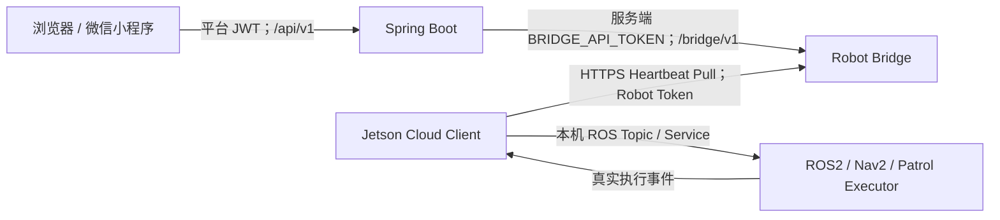
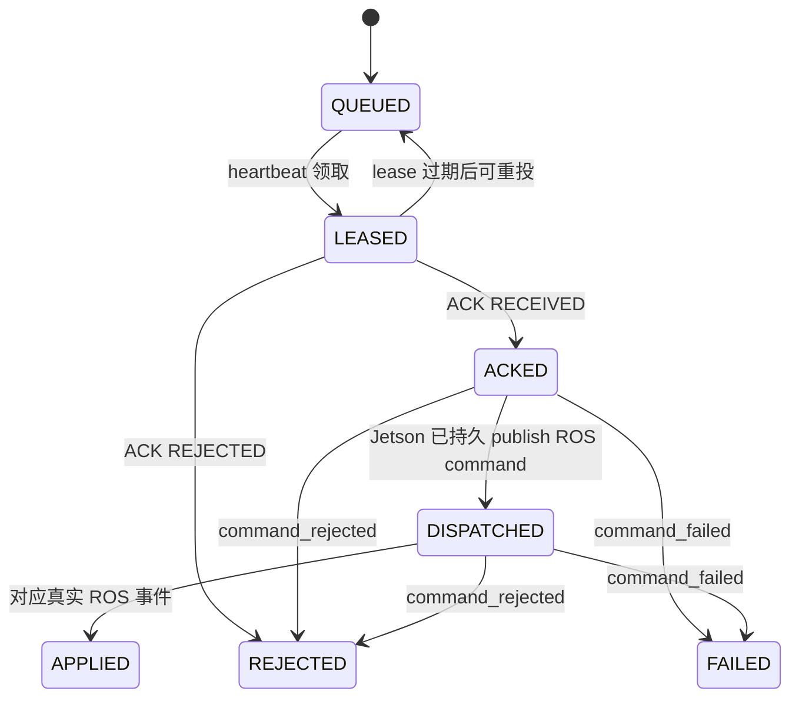
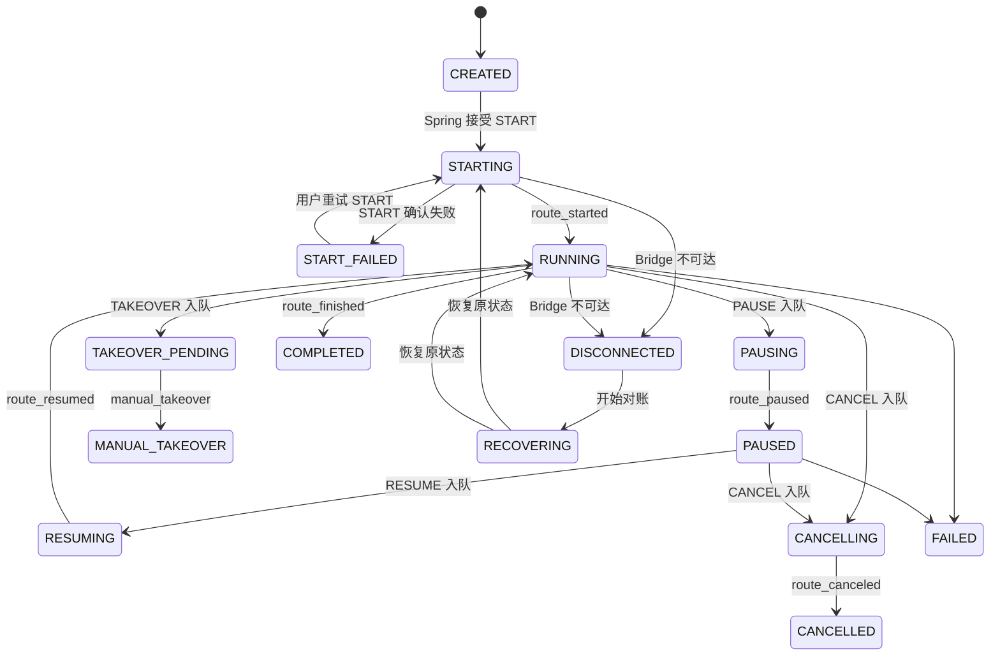
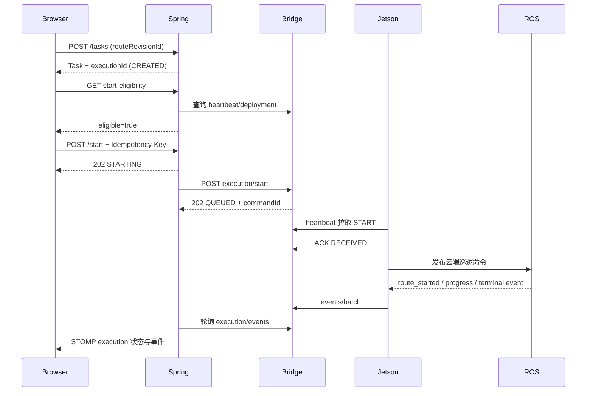

# Robot Platform Protocol v1

## 1. 文档信息

| 项目 | 值 |
| --- | --- |
| 线上 `protocolVersion` | `1.0` |
| 文档修订号 | `1.0.1` |
| 适用提交 | Robot `79df249` 及以后；Platform Bridge `c5b16e7` 及以后 |
| 更新时间 | 2026-07-16 |
| 稳定性等级 | RC：源码闭环已实现，待服务器部署与实机验收 |
| 责任人 | 平台后端、Robot Bridge 与 Jetson 机器人端共同维护 |
| 单一事实来源 | 平台仓库 `docs/protocol/robot-platform-v1.md`；机器人仓库同路径为字节一致副本 |

兼容原则：同一主版本只允许新增可选字段、可选事件和错误码；不得改变既有字段含义、哈希算法、幂等规则或终态语义。消费者必须忽略未知可选字段，生产者不得删除必填字段。破坏性修改必须升级协议版本。

## 2. 架构与信任边界



- 浏览器和微信小程序只访问 Spring Boot，不访问 `/bridge/v1` 或 `/robot-api/v1`。
- `BRIDGE_API_TOKEN` 只存在于服务器端，绝不能进入浏览器包、小程序包、localStorage 或前端环境变量。
- Robot Bridge 不反向访问 Jetson，不保存 Jetson URL，不要求 Jetson 公网 IP、端口映射或入站防火墙规则。
- Jetson 是公网连接的唯一发起方，通过 HTTPS 主动心跳、ACK、补传事件和下载 deployment。
- `/api/platform/v1/*` 是 Jetson 本机或可信局域网调试链路，不是公网主链路；配置 Cloud Link 后入站写控制默认关闭。

## 3. 标识符定义

| 标识符 | 生成方 | 生命周期 | 持久化 | 幂等键 | 可复用 |
| --- | --- | --- | --- | --- | --- |
| `taskId` | Spring Boot | 一条业务任务 | 平台数据库 | 否 | 不可跨任务复用 |
| `executionId` | Spring Boot | 一次任务执行 | 平台与 Bridge | 执行绑定键 | 不可绑定不同 robot/deployment |
| `deploymentId` | Spring Boot | 一份不可变部署快照 | 平台、Bridge、Jetson | 内容身份键 | 仅相同内容可重试 |
| `routeRevisionId` | Spring Boot | 一份不可变路线修订 | 平台、Bridge manifest、Jetson | 否 | 不可指向新内容 |
| `executorRouteId` | 路线编辑/发布流程 | 路线内执行入口 | 路线 JSON 与 command | 否 | 可被同一路线重复执行 |
| `robotId` | 平台运维注册 | 机器人身份全生命周期 | 各端 | 设备鉴权选择键 | 不可在设备间复用 |
| `commandId` | Robot Bridge | 一条投递命令 | Bridge 与 Jetson | 命令去重键 | 不可复用 |
| `requestId` | Spring Boot | 一次用户控制意图 | Spring、Bridge、Jetson | 是 | 相同业务载荷可重试；不同载荷禁止 |
| `bootId` | Jetson 进程启动时 | 一次 mobile bridge 进程生命周期 | 心跳/事件 | 否 | 重启后必须更换 |
| `sequence` | Jetson SQLite | robot 全局事件流 | Jetson 与 Bridge | 事件去重/顺序键 | 同一 robot 永不复用 |
| `leaseToken` | Robot Bridge | 一次命令租约 | Bridge；随 heartbeat 下发 | ACK 租约校验键 | 过期后不可复用 |

## 4. 鉴权与凭据

| 边界 | 凭据 | 存放位置 | 可读取方 | 绝对禁止读取方 |
| --- | --- | --- | --- | --- |
| Jetson → 设备 API | `ROBOT_AUTH_TOKENS_JSON` 中对应 token；Jetson 使用 `YLHB_CLOUD_ROBOT_TOKEN` | 服务器受保护 env；Jetson `platform.env` | `robotbridge` 服务、Jetson systemd 服务 | 浏览器、小程序、普通日志、仓库 |
| Spring → 管理 API | `BRIDGE_API_TOKEN` | 服务器受保护 env / Spring 服务凭据 | Robot Bridge、Spring Boot 服务 | 浏览器、小程序、Jetson、仓库 |
| Bridge → 平台 API | `PLATFORM_BEARER_TOKEN` | Robot Bridge 受保护 env | Robot Bridge 与 Spring 服务端 | 浏览器、Jetson、仓库 |
| 用户 → Spring | 平台 JWT | 浏览器会话存储 | 用户浏览器与 Spring | Robot Bridge、Jetson |

所有 API Token 使用 `Authorization: Bearer token-placeholder`。日志只能记录 robotId、requestId、commandId、HTTP 状态和脱敏后的服务器 URL；不得记录 Authorization、Token JSON、JWT、URL userinfo/query 或完整 env。轮换时先让服务端短期同时接受新旧设备 token，更新 Jetson 后确认 heartbeat，再删除旧 token；管理 token 应先更新 Spring 服务端，再重启 Bridge 与 Spring，并通过本机管理 health 验证。凭据文件建议 `root:robotbridge 0640`，Jetson `platform.env` 建议 `0600`。

## 5. 通用 HTTP 合同

- 公网设备 API 必须使用 HTTPS；不得关闭证书校验。私有 CA 通过 `YLHB_CLOUD_CA_FILE` 指定。
- JSON 请求使用 `Content-Type: application/json`；下载接口不需要请求体。
- 设备 API 和管理 API 成功响应均为原始 JSON，不使用 Spring `ApiResponse` 包装。
- 错误响应：

```json
{
  "code": "INVALID_REQUEST",
  "message": "request is invalid",
  "requestId": "request-demo"
}
```

- `requestId` 能从请求确定时应原样返回；当前实现的部分校验错误可能返回空字符串，调用方不得依赖错误响应一定带 requestId。
- `401` 不重试，先修复/轮换凭据；`409` 不盲重试，先按错误码处理；`429/503` 优先遵守 `Retry-After`；网络错误和 `5xx` 使用指数退避。

## 6. 设备 API

### 6.1 `POST /robot-api/v1/heartbeat`

请求头：`Authorization: Bearer token-placeholder`、`Content-Type: application/json`。Token 必须与 `robotId` 对应。

请求字段：

| 字段 | 类型 | 必填 | 说明 |
| --- | --- | --- | --- |
| `protocolVersion` | string | 是 | 固定 `1.0` |
| `robotId` | string | 是 | 设备身份 |
| `bootId` | string | 是 | 本次进程启动身份 |
| `softwareVersion` | string | 是 | Jetson 软件版本 |
| `state` | string | 是 | `idle/starting/running/paused/manual_takeover/returning_home/waiting_loop/succeeded/failed/canceled` |
| `activeExecutionId` | string/null | 否 | 当前 execution |
| `activeDeploymentId` | string/null | 否 | 当前 deployment |
| `lastReceivedCommandId` | string/null | 否 | 最近持久化命令 |
| `latestLocalEventSequence` | integer | 是 | Jetson 本地最新事件序号 |
| `mapPose` | object/null | 否 | map 坐标位姿 |
| `odomPose` | object/null | 否 | odom 坐标位姿 |
| `health` | object | 是 | 传感器 age、Nav2、系统模式和最后错误 |

请求示例：

```json
{
  "protocolVersion": "1.0",
  "robotId": "robot-001",
  "bootId": "robot-001",
  "softwareVersion": "79df249",
  "state": "idle",
  "activeExecutionId": null,
  "activeDeploymentId": null,
  "lastReceivedCommandId": null,
  "latestLocalEventSequence": 0,
  "mapPose": null,
  "odomPose": {"frame": "odom", "x": 0.0, "y": 0.0, "yaw": 0.0},
  "health": {"odomAgeSec": 0.1, "scanAgeSec": 0.1, "imuAgeSec": 0.1, "nav2": "not_running", "systemMode": "ready", "lastError": ""}
}
```

响应字段：

| 字段 | 类型 | 说明 |
| --- | --- | --- |
| `serverTime` | string | UTC ISO-8601 |
| `nextHeartbeatSec` | number | 建议下次心跳间隔 |
| `acceptedEventSequence` | integer | 服务器已连续确认的 robot 全局 sequence |
| `command` | object/null | 一次最多一条租约命令 |

响应示例：

```json
{
  "serverTime": "2026-07-13T00:00:00+00:00",
  "nextHeartbeatSec": 1,
  "acceptedEventSequence": 0,
  "command": {
    "commandId": "command-demo",
    "requestId": "request-demo",
    "type": "START",
    "executionId": "execution-demo",
    "deploymentId": "deployment-demo",
    "executorRouteId": "deployment-demo",
    "routeRevisionId": "deployment-demo",
    "leaseToken": "token-placeholder"
  }
}
```

HTTP：`200`、`400 INVALID_REQUEST`、`401 AUTH_FAILED`。心跳是可重试且覆盖 robot 最新快照；命令通过 commandId/requestId 去重。空闲默认 3 秒，活动或领到命令默认 1 秒；响应值优先。

### 6.2 `POST /robot-api/v1/commands/{commandId}/ack`

路径参数 `commandId` 为租约命令 ID。请求头同 heartbeat。

请求字段：

| 字段 | 类型 | 必填 | 说明 |
| --- | --- | --- | --- |
| `robotId` | string | 是 | ACK 所属机器人 |
| `leaseToken` | string | 是 | 当前未过期租约 |
| `status` | string | 是 | `RECEIVED` 或 `REJECTED` |
| `executionId` | string | 是 | 诊断关联字段 |
| `errorMessage` | string | 否 | REJECTED 原因，不得含凭据 |

```json
{
  "robotId": "robot-001",
  "leaseToken": "token-placeholder",
  "status": "RECEIVED",
  "executionId": "execution-demo",
  "errorMessage": ""
}
```

响应字段为 `commandId` 与 Bridge 状态：

```json
{"commandId": "command-demo", "state": "ACKED"}
```

HTTP：`200`、`400 INVALID_REQUEST`、`401 AUTH_FAILED`、`409 INVALID_LEASE`。相同有效 ACK 可安全重试，但 lease 过期或已换租约时必须重新 heartbeat；ACK 只表示 Jetson 已持久化，绝不表示 ROS 已执行。

### 6.3 `POST /robot-api/v1/events/batch`

请求头同 heartbeat。

请求字段：

| 字段 | 类型 | 必填 | 说明 |
| --- | --- | --- | --- |
| `robotId` | string | 是 | 批次所有者 |
| `events` | array | 是 | 最多 100 条；允许空数组 |
| `events[].schema_version` | string | 是 | `1.0` |
| `events[].robot_id` | string | 是 | 必须等于鉴权 robot |
| `events[].boot_id` | string | 是 | 事件生成进程 |
| `events[].sequence` | integer | 是 | robot 全局正整数 |
| `events[].event` | string | 是 | 事件类型 |
| `events[].execution_id` | string | 是 | execution 归属 |
| `events[].deployment_id` | string | 是 | deployment 归属 |
| `events[].request_id` | string | 是 | 控制请求归属 |
| `events[].command_id` | string | 是 | 命令归属 |
| `events[].occurred_at` | string | 是 | UTC ISO-8601 |
| `events[].error_code` | string | 否 | 错误码 |
| `events[].error_message` | string | 否 | 脱敏错误信息 |
| `events[].payload` | object | 否 | 事件扩展数据 |

```json
{
  "robotId": "robot-001",
  "events": [{
    "schema_version": "1.0",
    "robot_id": "robot-001",
    "boot_id": "robot-001",
    "sequence": 1,
    "event": "route_started",
    "execution_id": "execution-demo",
    "deployment_id": "deployment-demo",
    "request_id": "request-demo",
    "command_id": "command-demo",
    "occurred_at": "2026-07-13T00:00:00+00:00",
    "payload": {}
  }]
}
```

响应：

```json
{"acceptedThroughSequence": 1}
```

HTTP：`200`、`400 INVALID_REQUEST`、`401 AUTH_FAILED`、`409 ROBOT_NOT_FOUND/EVENT_OWNERSHIP_CONFLICT/EVENT_COMMAND_MISMATCH`。同一 `(robotId, sequence)` 可重复提交且不会重复应用。服务器只确认连续区间；缺口后事件可保存但 `acceptedThroughSequence` 不跨越缺口。

### 6.4 `GET /robot-api/v1/deployments/{deploymentId}/manifest`

请求头：`Authorization: Bearer token-placeholder`。路径 deployment 必须属于该 robot。

响应字段：

| 字段 | 类型 | 说明 |
| --- | --- | --- |
| `schemaVersion` | string | `1.0` |
| `deploymentId` | string | 不可变 deployment |
| `robotId` | string | 所属 robot |
| `routeRevisionId` | string | 路线修订 |
| `routeRevisionContentSha256` | string | canonical 路线修订哈希 |
| `routePayloadSha256` | string | 下载 route.json canonical 哈希 |
| `routeContentSha256` | string | 兼容字段，应等于修订哈希 |
| `mapAssetId` | string | 平台地图资产 |
| `mapImageSha256` | string | 原始 PGM 字节哈希 |
| `yamlName` | string | 原始安全文件名 |
| `pgmName` | string | 原始安全文件名 |

```json
{
  "schemaVersion": "1.0",
  "deploymentId": "deployment-demo",
  "robotId": "robot-001",
  "routeRevisionId": "deployment-demo",
  "routeRevisionContentSha256": "aaaaaaaaaaaaaaaaaaaaaaaaaaaaaaaaaaaaaaaaaaaaaaaaaaaaaaaaaaaaaaaa",
  "routePayloadSha256": "aaaaaaaaaaaaaaaaaaaaaaaaaaaaaaaaaaaaaaaaaaaaaaaaaaaaaaaaaaaaaaaa",
  "routeContentSha256": "aaaaaaaaaaaaaaaaaaaaaaaaaaaaaaaaaaaaaaaaaaaaaaaaaaaaaaaaaaaaaaaa",
  "mapAssetId": "deployment-demo",
  "mapImageSha256": "bbbbbbbbbbbbbbbbbbbbbbbbbbbbbbbbbbbbbbbbbbbbbbbbbbbbbbbbbbbbbbbb",
  "yamlName": "map.yaml",
  "pgmName": "map.pgm"
}
```

HTTP：`200`、`401 AUTH_FAILED`、`404 DEPLOYMENT_NOT_FOUND`。GET 可按指数退避重试；相同 deploymentId 内容不可变。

### 6.5 `GET /robot-api/v1/deployments/{deploymentId}/route`

请求头与幂等规则同 manifest。响应头包含 `Content-Type: application/json`、`Content-Length` 和安全 `Content-Disposition`。

```json
{
  "schemaVersion": "2.0",
  "routeId": "deployment-demo",
  "targets": []
}
```

HTTP：`200`、`401`、`404`。下载后必须解析 JSON、规范化并校验 `routePayloadSha256` 与 `routeRevisionContentSha256`；失败不得安装。

### 6.6 `GET /robot-api/v1/deployments/{deploymentId}/yaml`

请求头与幂等规则同 manifest。响应为原始 YAML，非 JSON：

```yaml
image: map.pgm
resolution: 0.05
origin: [0.0, 0.0, 0.0]
negate: 0
occupied_thresh: 0.65
free_thresh: 0.25
```

HTTP：`200`、`401`、`404`。必须校验 YAML 为对象、`image` 的 basename 等于 manifest `pgmName`，禁止路径穿越。

### 6.7 `GET /robot-api/v1/deployments/{deploymentId}/pgm`

请求头与幂等规则同 manifest。响应为原始 PGM 二进制，`Content-Type: image/x-portable-graymap`，不是 JSON。示意头：

```text
P5
1 1
255
<binary-byte>
```

HTTP：`200`、`401`、`404`。必须对完整字节计算 SHA-256 并等于 `mapImageSha256`；失败不得安装。

## 7. 管理 API

所有管理请求都使用 `Authorization: Bearer token-placeholder`，只允许 Spring Boot 或 SSH tunnel 中的运维调用。生产 Nginx 不公开 `/bridge/`。成功响应为原始 JSON。

### 7.1 `GET /bridge/v1/health`

```json
{"ok": true, "robots": ["robot-001"]}
```

HTTP：`200`、`401`。可重试；仅证明进程和配置加载，不证明 robot online。

### 7.2 `GET /bridge/v1/robots/{robotId}`

```json
{
  "robotId": "robot-001",
  "configured": true,
  "online": true,
  "bootId": "robot-001",
  "state": "idle",
  "lastSeen": "2026-07-13T00:00:00+00:00",
  "acceptedEventSequence": 1,
  "activeExecutionId": "execution-demo",
  "activeDeploymentId": "deployment-demo",
  "protocolVersion": "1.0",
  "softwareVersion": "79df249",
  "health": {}
}
```

HTTP：`200`、`401`、`404 ROBOT_NOT_FOUND`。GET 可重试。`online=true` 仅表示最后心跳不超过离线阈值。

### 7.3 `POST /bridge/v1/deployments/{deploymentId}/sync`

无请求体。Bridge 使用服务凭据从 Spring 获取 deployment、route revision、map asset 与原始 YAML/PGM。

```json
{
  "deploymentId": "deployment-demo",
  "state": "READY_FOR_ROBOT",
  "schemaVersion": "1.0",
  "robotId": "robot-001",
  "routeRevisionId": "deployment-demo",
  "routeRevisionContentSha256": "aaaaaaaaaaaaaaaaaaaaaaaaaaaaaaaaaaaaaaaaaaaaaaaaaaaaaaaaaaaaaaaa",
  "routePayloadSha256": "aaaaaaaaaaaaaaaaaaaaaaaaaaaaaaaaaaaaaaaaaaaaaaaaaaaaaaaaaaaaaaaa",
  "routeContentSha256": "aaaaaaaaaaaaaaaaaaaaaaaaaaaaaaaaaaaaaaaaaaaaaaaaaaaaaaaaaaaaaaaa",
  "mapAssetId": "deployment-demo",
  "mapImageSha256": "bbbbbbbbbbbbbbbbbbbbbbbbbbbbbbbbbbbbbbbbbbbbbbbbbbbbbbbbbbbbbbbb",
  "yamlName": "map.yaml",
  "pgmName": "map.pgm"
}
```

HTTP：`200`、`400 INVALID_REQUEST/ROUTE_HASH_MISMATCH/MAP_HASH_MISMATCH/INVALID_MAP`、`401`、`409 DEPLOYMENT_CONFLICT`、`503 PLATFORM_UNREACHABLE`。相同完整内容幂等；同 ID 不同 identity 或缓存不完整返回 409。

### 7.4 `POST /bridge/v1/executions/{executionId}/start`

请求字段：`robotId`、`deploymentId`、`executorRouteId`、`requestId` 必填；`taskId`、`profile` 可选。

```json
{
  "robotId": "robot-001",
  "deploymentId": "deployment-demo",
  "executorRouteId": "deployment-demo",
  "requestId": "request-demo",
  "taskId": "execution-demo",
  "profile": "inspection"
}
```

```json
{"accepted": true, "commandId": "command-demo", "state": "QUEUED", "executionId": "execution-demo"}
```

HTTP：`202`、`400 INVALID_REQUEST`、`401`、`404 DEPLOYMENT_NOT_FOUND`、`409 IDEMPOTENCY_CONFLICT/EXECUTION_CONFLICT`。相同 requestId 与相同业务载荷返回原 command；不同载荷返回 409。`202` 只表示持久入队。

### 7.5 控制 API

以下接口合同相同：

- `POST /bridge/v1/executions/{executionId}/pause`
- `POST /bridge/v1/executions/{executionId}/resume`
- `POST /bridge/v1/executions/{executionId}/takeover`
- `POST /bridge/v1/executions/{executionId}/cancel`

请求：

```json
{"robotId": "robot-001", "requestId": "request-demo"}
```

响应：

```json
{"accepted": true, "commandId": "command-demo", "state": "QUEUED", "executionId": "execution-demo"}
```

HTTP：`202`、`400 INVALID_REQUEST`、`401`、`404 EXECUTION_NOT_FOUND`、`409 IDEMPOTENCY_CONFLICT/EXECUTION_CONFLICT`。每次用户意图必须使用独立 requestId；网络超时可用原 requestId 重试，不能生成新 requestId 猜测重发。

### 7.6 `GET /bridge/v1/executions/{executionId}`

```json
{
  "executionId": "execution-demo",
  "robotId": "robot-001",
  "deploymentId": "deployment-demo",
  "state": "RUNNING",
  "lastEventSequence": 1,
  "lastError": ""
}
```

HTTP：`200`、`401`、`404 EXECUTION_NOT_FOUND`。可轮询重试；终态不可回退。

### 7.7 `GET /bridge/v1/executions/{executionId}/events`

查询参数：`afterSequence` 为排他下界，默认 `0`；`limit` 为 `1..100`，默认 `100`。

```json
{
  "events": [{
    "schema_version": "1.0",
    "robot_id": "robot-001",
    "boot_id": "robot-001",
    "sequence": 1,
    "event": "route_started",
    "execution_id": "execution-demo",
    "deployment_id": "deployment-demo",
    "request_id": "request-demo",
    "command_id": "command-demo",
    "occurred_at": "2026-07-13T00:00:00+00:00"
  }]
}
```

HTTP：`200`、`401`、`404 EXECUTION_NOT_FOUND`。Spring 只在事务成功后推进自己的 `lastRobotSequence`；重复事件按 `(robotId, sequence)` 去重。

## 8. 命令状态机



- HTTP `202` 只代表 Bridge 已持久化 `QUEUED`。
- `LEASED` 是服务器租约；15 秒租约过期后可重投，必须使用新 leaseToken。
- ACK `RECEIVED` 只代表 Jetson SQLite 已持久化命令。
- `DISPATCHED` 是 Jetson 本地状态，表示 ROS publish 已成功并持久记录；当前 Bridge SQLite 可能仍显示 ACKED，直到收到结果事件。
- `APPLIED` 必须来自 `route_started/route_paused/route_resumed/manual_takeover/route_canceled` 等真实 ROS 事件。
- `requestId` 是管理命令幂等键；相同 requestId 与不同业务 payload 必须 `409 IDEMPOTENCY_CONFLICT`。

## 9. Execution 状态机



Spring 平台状态包括 `CREATED/STARTING/RUNNING/PAUSING/PAUSED/RESUMING/CANCELLING/TAKEOVER_PENDING/MANUAL_TAKEOVER/COMPLETED/START_FAILED/FAILED/CANCELLED/DISCONNECTED/RECOVERING`。Bridge 内部 `DISPATCHING` 对应 Spring 的 `STARTING` 或控制等待态。`COMPLETED/FAILED/CANCELLED` 为吸收终态，不允许回到 RUNNING；`START_FAILED` 只允许由用户显式重试 START。

## 10. 事件与 sequence

- `sequence` 由 Jetson `DeploymentStore.append_event` 为 robot 全局递增分配，不按 execution 重置。
- `afterSequence` 是排他下界；查询结果只含 `sequence > afterSequence`。
- Bridge 只确认从已确认游标开始的连续区间。缺口之后的事件可以先保存，但不能改变 command/execution 状态。
- 重复 `(robotId, sequence)` 不重复插入，也不会重复改变状态。
- 事件必须同时属于鉴权 robot、execution、deployment 和 command；不一致返回 ownership/mismatch 错误。
- 终态保护优先于旧事件；晚到 `route_started` 不能把 COMPLETED 改回 RUNNING。
- 控制结果事件必须绑定对应控制 command；路线进度事件与 `route_finished/route_failed` 继续绑定 START command。

## 11. Deployment 合同

- `routeRevisionContentSha256`：平台不可变 revision 的 canonical `executorJson` SHA-256。
- `routePayloadSha256`：实际下载并规范化后的 `route.json` SHA-256；当前应与 revision hash 相等。
- `mapImageSha256`：原始 PGM 完整字节 SHA-256。
- `yamlName`、`pgmName` 保留原始文件名，只允许 basename 与 `.yaml/.yml/.pgm` 安全后缀。
- deployment 不可变：同一 deploymentId 相同身份与完整内容可幂等返回；不同内容或不完整缓存返回 `409 DEPLOYMENT_CONFLICT`。
- Jetson 校验顺序：manifest 身份 → 下载 route/YAML/PGM → 大小限制 → 路线 JSON 与 schema → route 两类哈希 → PGM 哈希 → YAML image 文件名 → route-map 绑定 → staging 原子安装。

## 12. 错误码

| 错误码 | 建议 HTTP | 含义/处理 |
| --- | ---: | --- |
| `AUTH_FAILED` | 401 | 凭据缺失/错误；不重试，轮换凭据 |
| `INVALID_REQUEST` | 400 | 字段、文件名、大小或格式错误 |
| `ROBOT_NOT_FOUND` | 404/409 | robot 未配置或未先 heartbeat |
| `ROBOT_BUSY` | 409 | 机器人已有活动执行 |
| `ROBOT_OFFLINE` | 409/503 | 超过离线阈值；等待 heartbeat |
| `PLATFORM_UNREACHABLE` | 503 | Bridge 无法读取 Spring；可退避重试 |
| `DEPLOYMENT_NOT_FOUND` | 404 | deployment 未同步或不属于 robot |
| `DEPLOYMENT_CONFLICT` | 409 | 同 ID 内容/身份不同或缓存不完整 |
| `EXECUTION_NOT_FOUND` | 404 | execution 不存在 |
| `EXECUTION_CONFLICT` | 409 | execution 改绑、重复 START 或归属冲突 |
| `IDEMPOTENCY_CONFLICT` | 409 | 相同 requestId 不同业务载荷 |
| `INVALID_LEASE` | 409 | ACK 租约不属于该 robot/command 或已过期 |
| `EVENT_OWNERSHIP_CONFLICT` | 409 | 事件 robot/execution/deployment/command 归属冲突 |
| `EVENT_COMMAND_MISMATCH` | 409 | 结果事件与 command 类型不匹配 |
| `ROUTE_HASH_MISMATCH` | 400 | 路线哈希不一致，禁止执行 |
| `MAP_HASH_MISMATCH` | 400 | PGM 哈希不一致，禁止执行 |
| `INVALID_ROUTE` | 400 | 路线 JSON/schema/绑定非法 |
| `INVALID_MAP` | 400 | YAML/PGM 或 image 绑定非法 |
| `INBOUND_CONTROL_DISABLED` | 409 | Jetson 本地入站写控制默认关闭 |
| `TIMEOUT` | 504/业务错误 | 调用超时；最终状态以查询/事件为准 |
| `INTERNAL_ERROR` | 500 | 未分类服务端错误；记录 requestId 后排障 |

实现还可能返回更细的 Jetson 本地错误，例如 `INVALID_COMMAND`、`COMMAND_CONFLICT`、`ROS_PUBLISH_FAILED`；跨系统对外时应映射到以上稳定错误码或作为 `lastErrorCode` 保留。

## 13. 网络、离线与恢复

- 空闲心跳默认 3 秒；活动/领到命令默认 1 秒；以服务端 `nextHeartbeatSec` 为准。
- Bridge 查询 robot 时以最后心跳 12 秒作为当前离线判定阈值。
- 网络失败采用 1、2、4、8、15、30 秒上限序列并加抖动；`YLHB_CLOUD_MAX_BACKOFF_SEC` 可限制最大值。
- 服务端返回数字 `Retry-After` 时 Jetson 优先使用，并限制到最大退避。
- 断网不会停止已在 ROS 中执行的巡检；本地安全控制、急停与 Nav2 继续有效。
- 恢复后先 heartbeat 获取 `acceptedEventSequence`，再从连续游标补传事件；命令恢复依据本地 command 状态和真实巡逻状态处理。
- UI 手动关闭只令 Cloud Client 进入 `DISABLED`，暂停云端心跳、命令领取和事件上传，不停止当前巡检；重新开启后补传积压事件。
- 配置缺失为 `UNCONFIGURED`；开启连接过程为 `CONNECTING`；成功为 `CONNECTED`；网络退避为 `BACKOFF`。

## 14. 当前实现边界

- Spring Boot 已实现 `app.robot.mode=bridge`、不可变 execution 快照、启动资格校验、Bridge START/控制投递、事件轮询与状态映射；仍需部署到服务器并完成无运动与现场实机验收。
- Bridge 管理 API 返回原始 JSON，Spring 必须在服务端适配并继续向前端返回 `ApiResponse`。
- `HttpRobotGateway/MobileBridgeClient` 是旧 Jetson `/api/debug` 局域网直连模式，不能复用为 Heartbeat Bridge Client。
- `READY_FOR_ROBOT` 只表示 Bridge 已缓存并校验路线与地图，不表示已创建 execution、已入队 START、机器人已领取命令或 ROS 已开始运动。

## 15. 浏览器到 Spring 业务 API

浏览器只访问 Spring `/api/v1`，所有成功响应继续使用平台 `ApiResponse` 包装。Bridge 模式下：

| 接口 | 要求 | 成功语义 |
| --- | --- | --- |
| `POST /api/v1/tasks` | `name`、`robotId`、`routeRevisionId` 必填；可选 `routeId` 必须与 revision 所属路线一致 | 同事务创建 Task 与不可变 `TaskExecution`，初始 `CREATED`，响应含 `executionId` |
| `GET /api/v1/tasks/{taskId}/start-eligibility` | 校验 robot CONNECTED、部署 READY、身份/哈希/active route 一致、无冲突活动 execution | `eligible=true` 才可请求启动 |
| `POST /api/v1/tasks/{taskId}/start` | 必须带 `Idempotency-Key` | HTTP `202`，Spring 已接受启动意图并等待 worker 向 Bridge 入队 |
| `POST /api/v1/tasks/{taskId}/pause` | execution 为 `RUNNING` | HTTP `202`，进入 `PAUSING` |
| `POST /api/v1/tasks/{taskId}/resume` | execution 为 `PAUSED` | HTTP `202`，进入 `RESUMING` |
| `POST /api/v1/tasks/{taskId}/takeover` | execution 为 `RUNNING`，带接管原因 | HTTP `202`，进入 `TAKEOVER_PENDING` |
| `POST /api/v1/tasks/{taskId}/cancel` | execution 为 `RUNNING` 或 `PAUSED` | HTTP `202`，进入 `CANCELLING` |

旧式 `/dispatch` 仅保留给 simulation/legacy 任务，不用于绑定 `routeRevisionId` 的 Bridge 任务。所有 `202` 都只表示请求已接受或命令已入队；只有 Jetson ACK、ROS publish 和对应真实事件逐级出现后，才能确认后续阶段。

## 16. 端到端时序



兼容策略：新增可选字段、可选事件和错误码保持 `protocolVersion: "1.0"`；删除必填字段、改变字段含义、幂等语义或终态语义等破坏性变更才升级到 `2.0`。

## 17. 双仓同步与发布检查

协议修改只在平台主文件完成，然后显式传入机器人仓库路径：

```bash
./scripts/sync_robot_protocol.sh --write <robot-repo-root>
./scripts/sync_robot_protocol.sh --check <robot-repo-root>
```

`--check` 使用 `cmp` 只读比较并打印两份文件的 SHA-256；`--write` 才会覆盖机器人副本。每次协议修改必须同时提交主协议、机器人同步副本及两边受影响的接口/状态/验收文档；发布记录保存脚本输出的两条 SHA-256。
